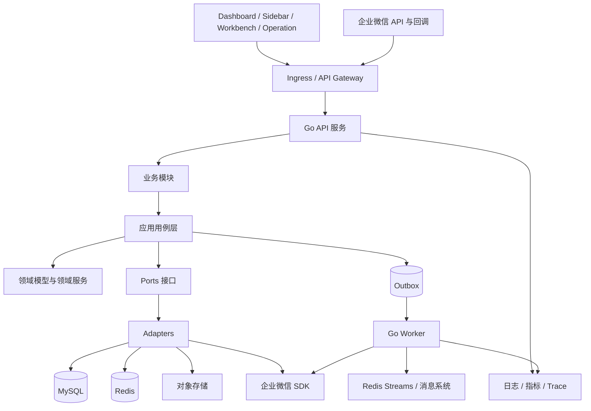
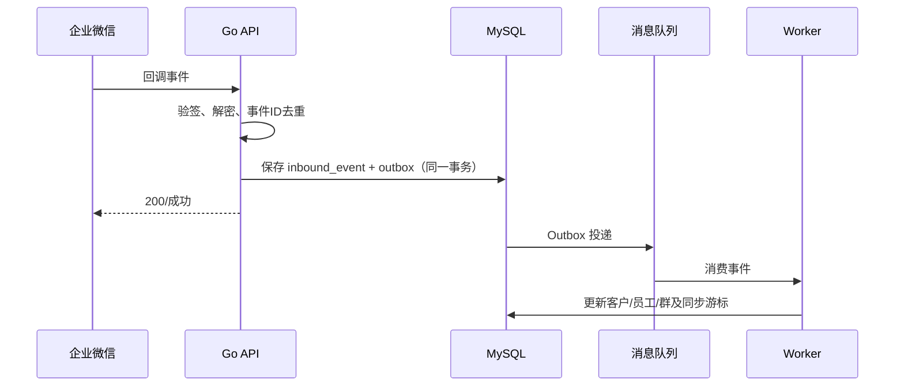

# MoChat 后端 Go 化迁移与架构设计说明书

**文档状态：** 建议评审稿  
**适用范围：** `api-server` PHP/Hyperf 后端及其 `plugin/mochat` 插件  
**目标读者：** 架构师、后端开发、测试、运维及项目负责人

## 1. 背景、现状与目标

MoChat 是面向企业微信的多租户 SaaS/CRM 系统，现有后端使用 PHP 7.4、Hyperf 2.2 与 Swoole。仓库中已识别出：

- 16 个核心业务域（如企业、租户、RBAC、客户、员工、群、素材、公众号等）；
- 10 个独立插件域（渠道码、客户群发、客户转接、欢迎语、自动拉群、群发、群标签、群欢迎语、统计、裂变）；
- 初始库约 70 张 MySQL 表；
- Redis 缓存及 10 条异步队列（员工、客户、欢迎语、群、会话、文件、回调、提醒、消息媒体等）；
- 企业微信 API/回调、定时同步、对象存储、文件/音视频处理等外部集成。

本项目的目标不是逐行翻译 PHP，而是在 **不破坏既有前端和数据资产** 的前提下，建立可长期演进的 Go 后端：

1. 保持现有 HTTP API、企业微信回调和任务行为的兼容性；
2. 提升并发处理、资源隔离、可观测性、测试和部署一致性；
3. 让新增业务以“模块 + 用例 + 端口”的方式接入，避免跨模块直接耦合；
4. 为日后的独立服务拆分保留边界，但首期不强行微服务化；
5. 支持灰度、回滚和数据一致性校验，实现可控迁移。

## 2. 关键架构决策

| 决策 | 选择 | 原因 |
| --- | --- | --- |
| 总体形态 | 模块化单体（Modular Monolith） | 当前模块间共享 MySQL 数据和业务流程较多；先获得清晰边界与低运维成本，再按热点拆分。 |
| 分层风格 | Clean/Hexagonal Architecture + DDD 轻量实践 | 将业务规则从 Gin、GORM、Redis、企业微信 SDK 中解耦，可替换且便于单测。 |
| HTTP 框架 | Gin（或项目统一的标准路由封装） | 成熟、生态稳定；框架只能位于 delivery 层。 |
| 数据访问 | `database/sql` + SQLC 为主；复杂查询手写 SQL | 编译期类型约束、SQL 可审计；避免 ORM 隐式查询和复杂关联失控。 |
| 迁移工具 | Atlas 或 golang-migrate | 所有 schema 变更版本化、可审查、可回滚。 |
| 异步任务 | Redis Streams / 兼容现有 Redis 的队列适配器，统一 Worker 框架 | 迁移期可并行消费；后续可平滑切换 Kafka/RabbitMQ。 |
| API 契约 | OpenAPI 3.1，契约优先 | 用于路由生成、请求校验、契约测试和前后端协作。 |
| 身份鉴权 | 短时 access token + 可撤销 refresh token；RBAC 权限快照 | 避免无状态令牌难撤销，同时兼容多租户。 |
| 可观测性 | OpenTelemetry + Prometheus + 结构化日志 | 每条请求/消息可关联 trace、租户与业务标识。 |

不建议首期采用“大而全微服务”。客户、员工、群、权限和企业微信同步天然高关联；在没有稳定 API 契约、事件规范和独立运维能力前拆分，会把进程内调用转化为不可靠的网络调用。

## 3. 目标架构



### 3.1 分层职责

- **Delivery：** HTTP、Webhook、CLI 和 Worker 入口。只做协议解析、认证、参数校验、响应映射；不得写业务规则或 SQL。
- **Application：** 用例编排、事务边界、授权判断、幂等控制和领域事件发布。例如“创建渠道码”“同步外部联系人”。
- **Domain：** 实体、值对象、聚合、领域服务及领域事件。不得依赖数据库、HTTP、Redis 或第三方 SDK。
- **Ports：** Repository、Cache、MessageBus、ObjectStorage、WeComClient、Clock 等接口。
- **Infrastructure：** MySQL、Redis、消息、企业微信、对象存储和观测实现；所有外部不稳定性在此收敛。

### 3.2 模块边界

目录按业务模块组织，而不是按全局的 controller/service/model 组织。首期模块及归属如下：

| 优先级 | Go 模块 | 对应旧域 | 职责 |
| --- | --- | --- | --- |
| P0 | `iam` | rbac、user、tenant | 登录、用户、角色、菜单、租户上下文、数据权限。 |
| P0 | `corp` | corp、work-agent | 企业微信企业授权、应用配置、回调配置。 |
| P0 | `integration/wecom` | utils/EasyWeChat、sync-data | 企业微信 API、签名验签、加解密、限流和重试。 |
| P1 | `organization` | work-employee、work-department | 员工、部门、离职/分配和同步。 |
| P1 | `contact` | work-contact | 外部联系人、标签、跟进、字段和客户关系。 |
| P1 | `room` | work-room | 客户群、群标签、群成员、群数据同步。 |
| P2 | `content` | medium、official-account、common | 素材、文件、公众号及公共配置。 |
| P2 | `campaign` | channel-code、greeting、welcome、batch-send、fission 等插件 | 获客和运营活动；每个活动为子模块。 |
| P2 | `chatops` | chat-tool、work-message | 会话工具、会话存档、敏感词和风控。 |
| P2 | `analytics` | statistic、index | 统计指标、看板和报表读模型。 |
| P3 | `platform` | install、system config、plugin | 安装、系统配置、审计、功能开关和插件注册。 |

模块只能通过公开 Application API、领域事件或明确的查询接口协作。禁止跨模块引用对方的数据库表模型；读场景可经查询接口或专用读模型获取数据。

## 4. 推荐仓库结构

建议新增平行目录 `api-server-go`，与旧 `api-server` 长期并存至迁移完成：

```text
api-server-go/
  cmd/
    api/                 # HTTP/Webhook 服务入口
    worker/              # 异步消费者入口
    scheduler/           # 定时调度入口（也可合入 worker）
    migrate/             # schema 迁移入口
  internal/
    platform/            # 配置、鉴权中间件、错误、日志、观测、事务
    modules/
      iam/
        domain/
        application/
        delivery/http/
        infrastructure/
      contact/ ...
    integration/
      wecom/
      storage/
      messaging/
  pkg/                    # 仅放可复用且稳定的公共库；默认不对外暴露
  db/
    migrations/
    queries/              # SQLC 查询
  api/openapi/            # 版本化 API 契约
  deployments/            # Helm/Kustomize、运行参数示例
  tests/
    contract/
    integration/
    e2e/
```

依赖方向必须单向：`delivery -> application -> domain`，`infrastructure -> ports/domain`。模块不得导入其他模块的 `infrastructure`；通过接口在组合根（`cmd`）注入具体实现。

## 5. 核心横切设计

### 5.1 多租户与权限

1. API 网关/中间件从 token 解析 `tenant_id`、`user_id`、`corp_id`、角色和请求 ID，写入不可变 `RequestContext`。
2. Repository API 必须接收 `TenantScope`；所有租户表查询强制附带 `tenant_id`。对无租户表使用显式 `SystemScope`，禁止默认全表查询。
3. SQLC 查询通过命名参数要求 `tenant_id`，并在代码评审/静态检查中阻止遗漏。
4. 菜单权限、按钮权限和数据范围在 Application 层统一判定；权限缓存附带用户版本号，角色变更时递增版本使缓存失效。
5. 每个租户维度实施 Redis 限流、队列配额和并发隔离，防止大租户挤占资源。

### 5.2 事务、一致性与幂等

- 单模块写操作在一个 MySQL 事务中完成；事务由 Application 用例开启，Repository 不自行嵌套开启。
- 跨模块/外部调用采用 **Outbox + 最终一致性**：同一事务写业务数据与 `outbox_events`，Worker 可靠投递；消费者以 `event_id` 去重。
- 对创建、导入、企业微信回调等写入口要求 `Idempotency-Key` 或来源事件 ID，并建立唯一索引。
- 企业微信调用设置超时、限流、指数退避（含抖动）、可识别错误码和最大重试次数；不可重试错误进入死信队列，提供人工重放。
- 数据库唯一约束是最后一道幂等防线，不能只依赖 Redis 锁。

### 5.3 回调与同步

企业微信回调 HTTP 入口只做验签、解密、最小字段校验和持久化原始事件，再快速返回成功。后续分发由 Worker 完成：



同步任务按企业和资源类型维护游标、最后成功时间、失败原因及补偿入口。全量同步与增量回调必须可交错执行，并以资源版本/更新时间和唯一键消除重复。

### 5.4 缓存、文件与数据

- Redis 用于缓存、限流、短期锁、会话与队列；不可作为唯一事实来源。
- 缓存 key 统一：`{env}:{module}:{tenantID}:{resource}:{id}:{version}`，必须设置 TTL、最大容量和失效策略。
- 媒体元数据存 MySQL，文件存 OSS/COS/S3 兼容对象存储；上传采用预签名 URL，下载和预览做权限校验。
- 将当前 SQL 安装脚本拆为可追踪迁移：先导入基线，再只追加版本化 migration；生产禁止手工改表。
- 历史大表（会话、同步日志、审计）按时间分区或归档，报表使用读模型，避免拖慢事务库。

### 5.5 API、错误与兼容性

- 首期保持现有路径、HTTP 方法、字段命名、分页语义、错误码与签名协议；新增 API 使用 `/api/v1`，不在旧接口上做破坏性改动。
- 统一响应体、错误码枚举和字段校验错误格式；错误日志不返回敏感信息。
- OpenAPI 以实际兼容契约为准，CI 中使用 diff 阻止破坏性变更；前端使用 mock/契约测试验证。
- API 入口进行 body 大小限制、JSON 严格解析、参数校验、CORS 白名单、请求超时和每租户限流。

## 6. 健壮性、质量与安全基线

### 6.1 工程质量门禁

每次合并至少执行：`gofmt`/`goimports`、`go vet`、静态检查、单元测试、竞态检测（重要包）、依赖漏洞扫描、OpenAPI 兼容性检查、迁移 lint 和镜像扫描。核心领域和用例测试覆盖率目标不低于 80%，整体覆盖率仅作趋势指标。

测试分层：

- 单元测试：领域规则、用例分支、权限、重试和幂等；端口使用 fake/mock。
- 集成测试：MySQL、Redis、队列、迁移和真实 SQL，建议 Testcontainers。
- 契约测试：PHP 与 Go 对同一请求的状态码、响应 JSON、错误码和副作用进行比对。
- E2E：登录、企业授权、客户同步、群管理、活动任务和回调重放等关键路径。
- 压测：登录、列表查询、回调突发、队列堆积恢复；容量指标由基线压测确定，而非主观预估。

### 6.2 安全要求

- 密钥（企业微信 corp secret、数据库、OSS）仅由 Secret Manager/Kubernetes Secret 注入；禁止出现在 Git、日志和错误响应中。
- 回调强制验签、时间窗校验和请求去重；后台接口使用 HTTPS、JWT 签名密钥轮换与 refresh token 吊销。
- 统一审计日志记录“谁、何时、哪个租户、操作什么、结果如何”，敏感字段脱敏；审计日志独立保留策略。
- SQL 使用参数绑定；上传文件验证 MIME、大小、扩展名，异步病毒扫描；对象存储桶默认私有。
- 为管理员接口配置细粒度权限、IP/设备策略（如业务需要）及高风险操作二次确认。

### 6.3 可观测与 SLO

日志为 JSON，字段至少含 `trace_id`、`request_id`、`tenant_id`、`user_id`、`module`、`event_id`、`error_code`。指标至少包括：请求量/延迟/错误率、数据库连接池、Redis、队列堆积与消费延迟、死信数量、企业微信 API 成功率与限流次数、同步滞后和租户维度资源使用。

建议上线初期约定：核心 API 月度可用性 99.9%，P95 延迟和回调处理时延按压测基线制定；告警覆盖错误预算消耗、队列积压、回调失败、同步落后、数据库连接耗尽和死信增长。

## 7. 迁移策略：绞杀者模式

采用“外围先迁、按业务域替换、双写仅在必要处使用”的绞杀者模式。PHP 服务保持可运行，Go 通过网关路由/特性开关逐步接管流量；任意模块可一键切回 PHP。

### 7.1 阶段与交付物

| 阶段 | 内容 | 完成判定 |
| --- | --- | --- |
| 0. 盘点与冻结 | 路由、SQL、队列、回调、定时任务、插件、前端调用全面盘点；补齐行为测试 | 有接口清单、依赖矩阵、关键流程回归基线。 |
| 1. Go 平台底座 | 项目骨架、配置、鉴权、错误、日志、Trace、迁移、CI、健康检查、队列框架 | 空服务可部署；质量门禁和本地一键环境可用。 |
| 2. 无状态/低风险域 | 健康检查、公共配置、素材读接口、系统管理读接口 | 契约测试通过，灰度流量稳定。 |
| 3. 身份与企业域 | IAM、租户、企业授权、企业微信 SDK/回调接入 | 登录与授权等价，回调可去重且可重放。 |
| 4. 核心业务域 | 组织、客户、群，先读后写，迁移同步任务和队列消费者 | 数据校验通过，关键写操作可灰度。 |
| 5. 插件与运营域 | 渠道码、欢迎语、群发、裂变、统计等按依赖顺序迁移 | 每个插件独立开关、独立回滚。 |
| 6. 收尾 | Go 全量接管、冻结 PHP 写入、归档/删除 PHP 服务 | 连续稳定运行一个发布周期，完成审计与下线预案。 |

### 7.2 路由、写入与回滚

1. 在 Ingress/API Gateway 按“接口 + 租户 + 百分比”路由至 PHP 或 Go；路由配置版本化并审计。
2. 读接口先进行影子请求：用户实际响应来自 PHP，异步对比 Go 响应的状态、字段、排序和权限结果。
3. 写接口优先选择单写切换：切至 Go 后由 Go 写同一数据库，PHP 不再处理该接口。仅在确有需要时短期双写，并提供对账和补偿任务。
4. 回调事件以稳定事件 ID 作为幂等键。迁移期只能有一个“权威消费者”更新同一类业务事实，其余消费者只能影子验证。
5. 发布单元以模块为界；出现错误率、数据对账或队列积压超阈值时，网关立即切回 PHP，保留 Go 事件与 trace 供修复。

### 7.3 数据校验

对每个迁移模块建立可重复执行的校验任务：总量、按租户计数、主键集合抽样、关键字段哈希、关联完整性、状态机分布和最近 N 小时增量差异。校验结果写入 `migration_reconciliation_runs`，不得依赖人工截图确认。

## 8. 发布与运维方案

- **运行单元：** `api`、`worker`、`scheduler` 分离部署和独立扩缩容；API 不执行长任务。
- **部署：** 容器化，Kubernetes 以 Deployment/HPA 管理 API，以 Deployment 管理 Worker，以 CronJob 或 leader election 调度周期任务。
- **优雅停机：** 先从负载均衡摘流；API 等待在途请求，Worker 停止拉取、完成/安全回退在途消息；设置可配置的超时时间。
- **配置：** 12-factor 环境变量 + 受控配置中心；配置有 schema 校验、默认值和启动失败保护。
- **数据库：** schema 迁移在发布前的专用 Job 执行；采用 expand/contract（先加字段/兼容读写，再回填，最后删旧字段）避免不可逆发布。
- **灾备：** MySQL PITR、对象存储版本/生命周期、Redis 高可用；恢复流程应定期演练并记录 RTO/RPO。

## 9. 实施规范与示例

### 9.1 用例接口示意

```go
// application/contact/create.go
type CreateContactCommand struct {
    TenantID string
    CorpID   string
    ExternalUserID string
    Name string
}

type ContactRepository interface {
    Create(ctx context.Context, contact Contact) error
    ExistsByExternalUserID(ctx context.Context, scope TenantScope, id string) (bool, error)
}

type CreateContactHandler struct {
    tx TransactionManager
    repo ContactRepository
    events EventPublisher
}

func (h *CreateContactHandler) Handle(ctx context.Context, cmd CreateContactCommand) error {
    // 授权、参数规则、幂等、事务写入和事件记录均在此编排。
    return nil
}
```

要求：context 必须从入口透传；所有 I/O 设置超时；禁止 `panic` 作为业务错误；错误以可判定的领域/应用错误返回并由入口统一映射。

### 9.2 领域事件规范

事件名采用 `模块.实体.动作.v版本`，例如 `contact.external_contact.upserted.v1`。事件 envelope 至少含：`event_id`、`event_name`、`occurred_at`、`tenant_id`、`aggregate_id`、`trace_id`、`schema_version`、`payload`。事件 payload 只携带消费者必需数据；敏感数据改传引用或脱敏值。

## 10. 主要风险与应对

| 风险 | 影响 | 应对 |
| --- | --- | --- |
| PHP 隐式行为未被发现 | Go 行为不兼容 | 先生成 API/队列/任务清单，建立契约与影子比对，再迁移。 |
| 企业微信回调重复、乱序或限流 | 数据错乱/同步延迟 | 事件去重、游标、版本比较、重试退避、死信重放和单权威消费者。 |
| 双写不一致 | 数据污染 | 优先单写切换；双写必须短期、可观测、可对账和可补偿。 |
| 超大模块（客户域）迁移周期长 | 进度失控 | 按读/写、子聚合和队列拆分；每次交付均可独立灰度。 |
| Go 团队经验不足 | 质量不稳定 | 代码模板、ADR、结对评审、质量门禁与故障演练。 |
| 旧数据库缺少约束 | 幂等和一致性差 | 在兼容迁移中逐步补唯一索引、外键/逻辑约束和数据清洗。 |

## 11. 验收标准

1. 所有已迁移 API 的 OpenAPI 契约、前端回归和 PHP/Go 契约测试通过。
2. 已迁移业务域的租户隔离、权限、审计、幂等、重试和异常路径均有自动化测试。
3. 数据对账连续多个发布周期无未解释差异；回调、队列和定时任务可重放且无重复副作用。
4. 生产具备仪表盘、告警、日志检索、Trace 关联、发布回滚和灾备恢复手册。
5. Go 服务通过压测容量基线；在节点重启、Redis 短暂不可用、企业微信超时等故障注入下满足既定恢复目标。
6. PHP 服务下线前，所有写入口、队列消费者和计划任务已迁移或被明确废弃，且完成一次完整回滚演练。

## 12. 首个迭代建议

首个两周迭代不迁业务写链路，交付以下可验证基座：`api-server-go` 骨架、Docker/本地依赖、健康检查、配置校验、日志与 Trace、统一错误、OpenAPI 示例、MySQL/Redis 连接、迁移工具、IAM 的只读 `me` 接口，以及与 PHP 的契约比对脚本。完成后再以“企业授权 → 组织同步 → 客户 → 群 → 运营插件”的依赖顺序持续迁移。

---

### 附录：迁移前必须补齐的盘点清单

- 所有 Action 路由、方法、鉴权、中间件、请求/响应样例及前端调用方；
- 所有模型与表的主键、租户字段、唯一约束、软删除、分表和历史数据规模；
- 所有 Redis key、缓存失效点、锁、队列名称、任务 payload、重试与消费并发；
- 所有 crontab/task/listener、外部 HTTP、OSS、FFmpeg 和企业微信 SDK 调用；
- 所有插件的依赖、安装/启用逻辑、菜单/权限和数据表；
- 生产流量、错误、延迟、队列积压及资源使用基线；
- 现有测试覆盖和缺失的关键业务验收样例。
