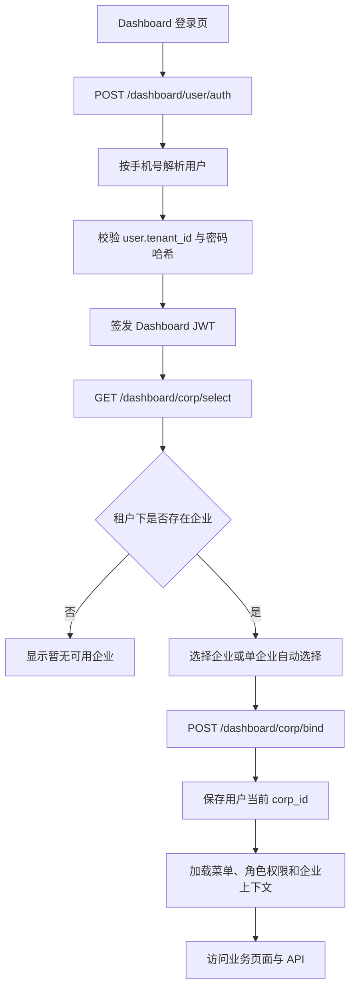

# Phase 3：SaaS、租户、Dashboard 数据流与菜单状态

更新时间：2026-08-01

依据：`phase3.2/dashboard-eight-real-pages` 分支，Phase 3.2 完成提交 `7a5561a`，以及当前运行中的 `mochat-go-desktop` 数据库和容器配置。

## 一、核心概念

| 对象 | 关键标识 | 作用 |
| --- | --- | --- |
| SaaS 平台管理员 | 平台身份 / SaaS token | 管理租户、套餐、开户任务、平台审批和系统运行状态 |
| 租户 | `tenant_id` | 客户组织的安全边界；用户、企业和业务数据首先归属租户 |
| Dashboard 用户 | `mc_user.tenant_id` | 登录 Dashboard 的账号；手机号在租户内识别用户 |
| 企业 | `mc_corp.id`、`mc_corp.tenant_id` | 租户下的业务企业，Dashboard 的业务操作必须选择一个 `corp_id` |
| 企业员工 | 企业关联的 employee/work employee | 决定用户能否在某个企业下执行客户、会话等业务操作 |
| 角色与菜单 | 角色、菜单绑定 | 决定账号登录后能看到哪些路由和操作权限 |

`tenant_id` 和 `corp_id` 不是同一个维度：租户决定数据归属，企业决定业务上下文。账号有角色权限，并不等于账号自动拥有一个错误租户下的企业。

## 二、SaaS 用户/租户创建流程

### 1. SaaS 平台创建租户

开户请求进入 SaaS 管理接口后，服务端完成以下动作：

1. 校验平台管理员权限、幂等键、套餐和租户参数。
2. 固化管理员手机号和密码哈希；响应、任务和审计记录不返回明文密码。
3. 创建或恢复租户记录，得到 `tenant_id`。
4. 创建租户初始管理员用户，并写入 `mc_user.tenant_id`。
5. 创建超级管理员角色、菜单绑定和平台访问授权。
6. 创建套餐订阅、配额、用量指标和 seed 版本记录。
7. 创建租户默认企业，或要求后续通过企业开户流程创建企业。
8. 写入开户任务、审批、操作日志和可追溯结果。

### 2. Dashboard 用户登录



### 3. SaaS 管理员登录

SaaS 管理端入口通常是 `/saas-admin/`，登录页是 `/security/login`。它复用 Dashboard 的密码认证接口，但成功后保存的是 SaaS 管理 token：

```text
/security/login
  -> POST /dashboard/user/auth
  -> mochat_go_saas_admin_token
  -> /dashboard/saasAdmin/accessProfile
  -> SaaS 平台权限、租户和审批接口
```

SaaS 管理端不通过 Dashboard 的当前 `corp_id` 来决定平台权限；SaaS 平台权限由身份策略、平台角色和 SaaS 管理授权决定。Dashboard 业务页面则必须有当前企业上下文。

## 三、业务请求的数据流

```text
浏览器 JWT
  -> 服务端解析 user_id / tenant_id
  -> Redis 或请求上下文读取当前 corp_id
  -> 校验用户、租户、企业和员工关联
  -> 校验角色/菜单/动作权限
  -> repository 使用 tenant_id + corp_id 查询或写入
  -> 审计记录操作人、租户、企业、动作、结果和时间
```

Phase 3.2 的 SCRM API 使用 `/dashboard/scrm` 前缀。所有客户、分配、商机、跟进和标签数据都必须带租户与企业边界；客户端提交的租户边界不能覆盖服务端认证上下文。

## 四、当前环境发现的问题

当前 desktop 数据库核对结果：

| 记录 | 当前值 |
| --- | --- |
| Dashboard 管理员 `13800000000` | `tenant_id = 1` |
| 现有企业“测试演示企业” | `tenant_id = 2` |

因此该账号调用 `/dashboard/corp/select` 时不会得到可用企业，页面会显示“暂无可用企业”。这不是用户角色或菜单授权缺失，而是租户与企业归属不一致。修复方式是为 `tenant_id = 1` 创建/恢复企业，或重新以同一租户完成开户；不能把 `corp_id` 为 2 的企业直接伪装成租户 1 的企业。

## 五、Phase 3.1 菜单状态

Phase 3.1 当前没有完成真实业务页面清零，状态仍应按 manifest 记录：

### 已有单元测试的 Demo 页面（按当前 manifest 为 8 个）

- `/chat/v2-staff`
- `/chat/v2-customer`
- `/chat/v2-group`
- `/ai-insight/v2/risk`
- `/ai-insight/v2/timeout`
- `/ai-insight/session-analysis`
- `/acquisition/v2-channel-code`
- `/customer/group`

以上页面仍只能视为演示，不代表业务闭环完成。

### 尚未开始的 Placeholder 页面

会话：`/chat/trajectory`、`/chat/export`、`/chat/file-audio`、`/chat/resign-staff`、`/chat/refuse-archive`、`/customer/inheritance`。

风险与 AI：`/ai-insight/v2/customer-loss`、`/ai-insight/v2/message-intercept`、`/ai-insight/v2/keyword-library`、`/ai-insight/v2/silent-customer`、`/ai-insight/smart-analysis`、`/ai-insight/emotion`、`/ai-insight/employee-score`、`/ai-insight/communication-keyword`。

营销：`/acquisition/group-code`、`/acquisition/redirect-link`、`/acquisition/wechat-customer-service`、`/acquisition/live-code-short-chain`、`/acquisition/group-template`、`/acquisition/precise-group-send`、`/acquisition/friends-circle`、`/acquisition/material-management`。

SCRM 与报表：`/customer/friends`、`/customer/order`、`/customer/settings`、`/data/customer`、`/data/employee`、`/data/conversion`、`/data/behavior`、`/data/report`。

企业设置：`/ai-setting/ai-knowledge-base`、`/ai-setting/agent`、`/company-setting/website`、`/company-setting/staff`、`/setting/role`、`/setting/additional`、`/setting/authorization`。

汇总：按当前实现分支 manifest，Phase 3.1 为 8 个 `demo/unit-passed`、39 个 `placeholder/not-started`。旧设计文档中的 9/41 是历史基线口径；`/index` 与 `/chat/v2-all` 已转入 Phase 3.2，因而不再重复计入 Phase 3.1。不能把菜单可见、路由可达或单元测试通过当作业务完成。

## 六、Phase 3.2 菜单状态

以下 8 个菜单已在完成分支中达到 `backend=ready`、`acceptance=e2e-passed`：

| 路由 | 页面 | 实现 | 状态 |
| --- | --- | --- | --- |
| `/index` | 数据概览 | native | 已完成并通过 E2E |
| `/chat/v2-all` | 全局消息 | native | 已完成并通过 E2E |
| `/ai-insight/v2/sensitive-word` | 敏感词 | legacy-adapter | 已完成并通过 E2E |
| `/customer/clue/default` | 线索池 | native | 已完成并通过 E2E |
| `/customer/contact` | 联系人 | legacy-adapter | 已完成并通过 E2E |
| `/customer/opportunity` | 商机 | native | 已完成并通过 E2E |
| `/customer/public-sea` | 公海 | native | 已完成并通过 E2E |
| `/customer/tags` | 标签 | native | 已完成并通过 E2E |

Phase 3.2 已完成的业务闭环包括：线索与联系人、负责人/协作人/公海、商机阶段与丢单原因、不可变跟进时间线、标签创建/绑定、Overview 查询范围、Global Conversation 查询范围，以及租户/企业隔离和查询索引加固。

## 七、后续修复优先级

1. 先为当前管理员所属租户 `1` 创建默认企业，验证 `/dashboard/corp/select`、`/dashboard/corp/bind` 和 Dashboard 首屏。
2. 将 desktop 的 SaaS 开关和 Identity Security 加密密钥写入可重复部署配置，避免仅依赖当前 PowerShell 会话环境变量。
3. Phase 3.3 优先处理会话与风险预警页面；Phase 3.4 处理营销工具；Phase 3.5 处理 SCRM 扩展与报表；Phase 3.6 处理 AI 与企业设置。
4. Phase 3 Final 前，所有 `demo` 和 `placeholder` 必须完成真实后端、持久化、权限、异常、E2E 和证据闭环。
