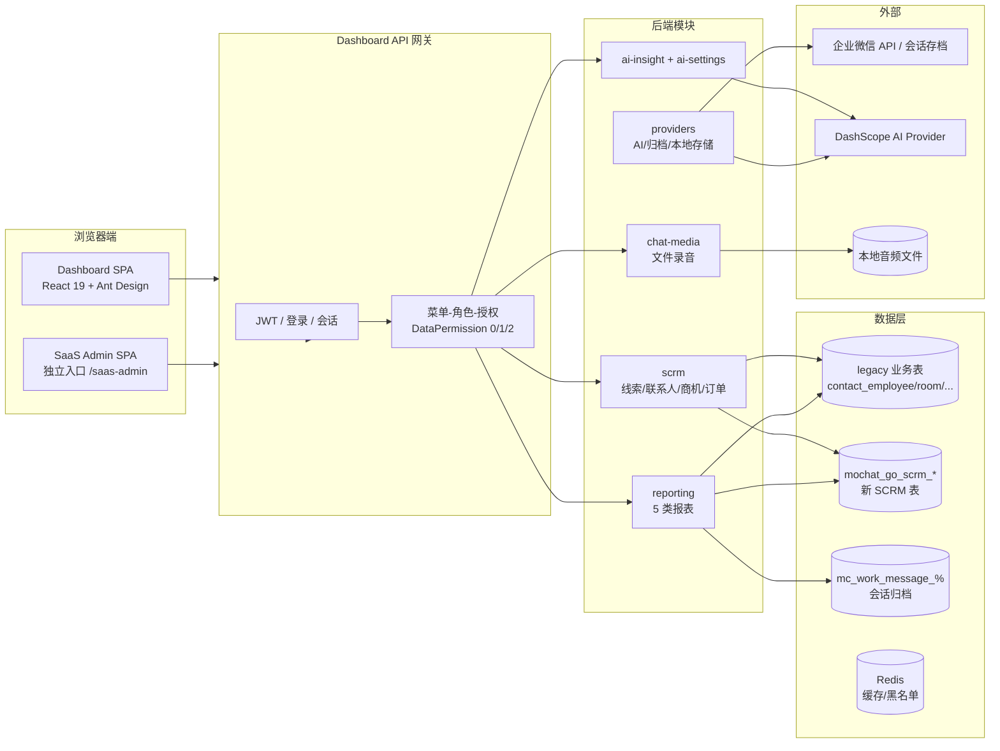
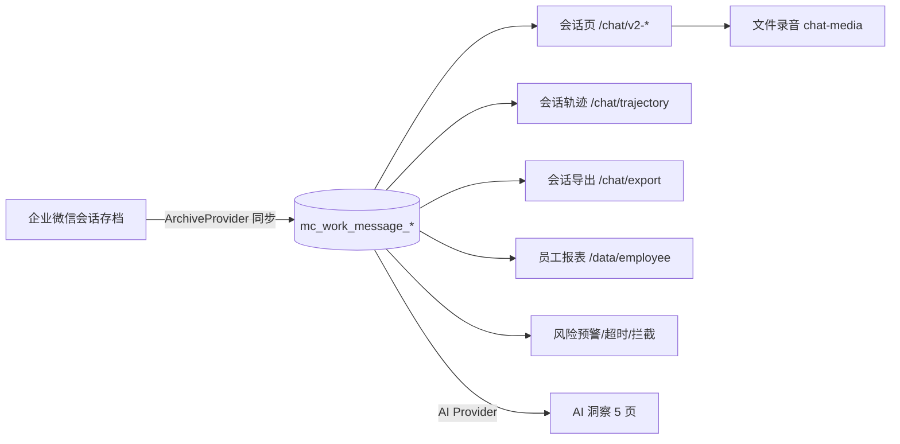
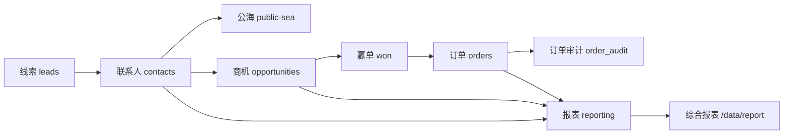
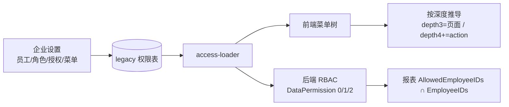
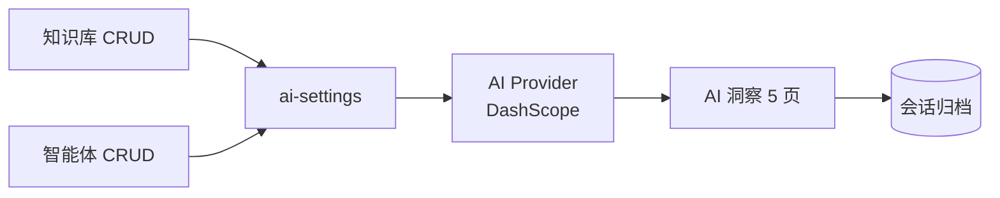

# Dashboard 系统概况：数据流向、使用场景与工作流合理性分析

- 分析日期：2026-08-08
- 分析基线：`main` @ `9b6515e`（领先 `origin/main` 1 个提交，尚未推送）
- 分析范围：Dashboard 前端（`web/apps/dashboard/src`）与后端核心模块（`internal/modules/{scrm,reporting,ai-insight,ai-settings,chat-media,providers}`、`internal/dashboard`、`internal/store`），运行中应用 `http://127.0.0.1:18080`
- 分析方式：源码逐读 + 运行库/接口核实 + 浏览器实测 + 行业最佳实践对照
- 文档性质：纯分析，不包含代码改动；涉及后续建议仅作资源倾斜参考

> 本文件是 2026-08-06《主目标盘点与执行路线》、2026-08-07《Dashboard 代码/视觉/工作流综合审查报告》的后续延伸，重点回答三个问题：系统现在怎么操作、数据从哪里来到哪里去、下一步资源应该往哪个方向倾斜。

---

## 1. 总体结论（先看这一段）

当前系统已经具备一条**可演示、可验收、但尚未完全生产化**的完整主线：

1. **客户业务链路基本闭环**：线索 → 联系人/公海 → 商机 → 赢单/订单 → 报表/综合报表，数据落在 `mochat_go_scrm_*` 新表，报表口径一致，筛选参数（员工/部门）与数据权限已对齐。
2. **会话与归档链路具备基础**：企业微信会话存档同步到 `mc_work_message_%`，会话列表、员工报表、文件录音、风险预警共享同一归档底座；但真实 Provider 数据缺失，文件音频仍标记未完成。
3. **配置与权限链路完整但偏“旧”**：菜单/角色/员工/授权沿用 legacy 数据模型，前端按菜单深度推导页面与 action；功能权限可用，数据权限在报表上做了交集收敛，但部门维度在部分数据表没有真实列。
4. **AI 链路目前是“空壳+占位”**：AI 洞察 5 页统一受限态（`AI_INSIGHT_ENABLED=0`），知识库/智能体只有 CRUD，没有真实推理能力；测试期有意关闭，但产品心智上仍占用了 7 个菜单入口。
5. **最大的结构性缺口是两套数据口径并存**：数据概览 `/index` 走 legacy `corp_data`（`contact_employee`/`room` 等旧表），Phase 3.5 报表走 `mochat_go_scrm_*` 新表；同一登录用户在不同页面看到的是两个“客户数”。

**资源倾斜结论**：

- 短期（1–2 周）：统一数据口径，把 `/index` 概览页接到 SCRM/归档真实数据；清理验收数据；把 AI 入口收敛为“未接入”单一引导，避免空壳占心智。
- 中期（1–2 个月）：按角色分化工作台（销售/运营/管理者），报表补目标/环比/下钻；菜单从“深度推导”改为“显式配置”。
- 长期：AI 先聚焦非结构化场景（会话摘要、风险识别、话术检索），再考虑预测类指标；审计与数据权限治理按“资源-行为-变更”三层补全。

---

## 2. 系统定位与总体架构

### 2.1 一句话定位

这是一个**面向企业微信生态的 SCRM + 会话存档 + 数据分析 + AI 洞察的一体化运营工作台**：企业员工用它跟进客户、执行营销、查看会话与报表；企业管理员用它配置组织、角色、菜单与授权；平台侧另有独立 SaaS Admin 管理租户生命周期。

### 2.2 架构总览

### 2.3 前端构成

Dashboard 前端由三部分组成：

1. **Yuanhu 基准 53 页清单**（`benchmark/manifest.json`）：8 个分组、P0=3 / P1=9 / P2=41。P0 为原生实现页；P1 为 Demo 页；P2 大部分仍是占位或兼容页。
2. **Phase 3.x 原生功能页**：Phase 3.3 会话与风险预警、Phase 3.4 获客营销、Phase 3.5 SCRM 扩展 4 页 + 数据报表 5 页，共 9 页为原生实现（`page-registry.tsx` 直接注入）。
3. **通用业务工作台**（`BusinessWorkbenchPage` + `businessRouteCatalog`）：由 legacy `migration-routes.json` 减去专用页后自动生成 list/form/detail/statistics 四类泛页，用于承接 500+ 旧路由中尚未专门化的部分。

权限模型要点：

- 前端菜单树由后端返回，`buildMenuAccess` 按**菜单深度**推导：depth 3 的内链注册为页面路由；depth 4+ 的 `linkUrl` 计为操作 action。
- 后端 RBAC 数据权限三档：`DataPermissionAll=0`（全部）/ `DataPermissionDepartment=1`（部门）/ `DataPermissionSelf=2`（本人）。
- 报表服务把 `AllowedEmployeeIDs` 与请求的 `EmployeeIDs` 做**交集**收敛；部门筛选在无部门列的数据表上返回 `limitation`，不会静默越权。

### 2.4 后端模块与数据表

| 模块 | 职责 | 关键表 |
| --- | --- | --- |
| `scrm` | 线索、联系人、公海、商机、标签、订单、客户设置、客户继承 | `mochat_go_scrm_leads/contacts/assignments/opportunities/follow_ups/orders/order_audit/settings` |
| `reporting` | 客户/转化/行为/员工/综合 5 类报表 | SCRM 新表 + 会话归档表 |
| `ai-insight` | 会话分析、智能分析、情绪、员工评分、沟通关键词 | `mochat_go_ai_analysis`（当前受限） |
| `ai-settings` | 知识库、智能体 CRUD | `mochat_go_ai_knowledge_bases/agents` |
| `chat-media` | 文件录音上传/播放/删除 | 本地磁盘 + DB 元数据 |
| `providers` | AI（DashScope）、企业微信会话归档、本地音频三态 Provider | `ready / limited / unavailable` |
| `dashboard`（legacy） | 数据概览 `corpData` | `contact_employee`/`room` 等旧表 |

---

## 3. 核心数据流

### 3.1 链路 A：会话与归档（企业微信 → 归档表 → 会话/报表/AI）

现状评估：

- 数据底座统一（归档表），会话页与员工报表共享，这是正确的架构方向。
- **缺口**：当前运行库没有真实企业微信会话存档数据；文件音频 `/chat/file-audio` 因缺少可验证的音频存储/读取 Provider 保持未完成（Phase 3.3 结论）。
- **缺口**：`/index` 概览页的“会话数据/质检数据/员工排行/会话轨迹”模块是硬编码 0 与空态，与链路 A 没有真实联通（详见 3.5）。

### 3.2 链路 B：客户业务（线索 → 联系人/公海 → 商机 → 赢单 → 订单 → 报表）

现状评估：

- **链路完整**：从线索到订单、再到审计与报表，Phase 3.5 已实现真实闭环；转化漏斗点击阶段可下钻真实对象明细（8-07 审查 A 批修复）。
- **口径已收敛**：报表的“客户”= 联系人 + 分配关系（assignments）；转化 = leads→contacts→opportunities→won→orders；行为 = order_audit；员工 = 归档表；综合报表每张 KPI 卡使用单一主指标并附口径说明（8-07 审查 I5 已修复）。
- **缺口**：订单状态机有审计，但线索/商机阶段变更目前没有同等粒度的操作审计；数据权限在部门维度仍依赖 `limitation` 提示而非真实列。

### 3.3 链路 C：配置与权限（菜单/角色/员工/授权 → 前端菜单与 action）

现状评估：

- **功能权限可用**：菜单隐藏、action 过滤、报表员工交集均已实现。
- **风险点**：页面/action 的语义由菜单深度隐式决定，菜单结构调整会连带改变前端可访问面；且 legacy 权限表与 53 页 manifest、`migration-routes.json` 三处并行维护，新增页面需要同步多个清单。
- **风险点**：`/setting/role`、`/setting/additional`、`/setting/authorization` 与 legacy 迁移页并存，同一企业可能存在“新旧两套设置入口”，需要明确哪一套是权威。

### 3.4 链路 D：AI 洞察（知识库/智能体 → AI Provider → 会话洞察）

现状评估：

- 架构抽象正确：Provider 三态（`ready/limited/unavailable`），页面统一受限态，测试期关闭外部调用（`AI_INSIGHT_ENABLED=0`）。
- **当前是空壳**：5 个 AI 洞察页全部 `capability=limited, provider=none`，知识库/智能体只是 CRUD；菜单里同时存在 `/ai-insight/session-analysis` 等 5 个入口 + `/ai-insight/v2/*` 风险类 6 个入口，心智负担大于实际能力。
- 建议后续把“未接入”收敛为一个全局状态组件 + 单一配置入口，而不是每个页面重复“受限”文案（8-07 审查 I7 已部分统一，仍可进一步收敛）。

### 3.5 重点：两套数据口径并存

| 维度 | 数据概览 `/index` | Phase 3.5 报表 `/data/*` |
| --- | --- | --- |
| 接口 | `/corpData/index` | `/dashboard/reports/{kind}` |
| 后端 | `internal/dashboard/corp_data.go`（legacy） | `internal/modules/reporting`（新模块） |
| 数据表 | `contact_employee` / `room` 等旧表 | `mochat_go_scrm_contacts/assignments/opportunities/orders` 等新表 |
| 客户定义 | `contact_employee.status=1 且未删除` | 联系人 + assignments 分配关系 |
| 会话/质检 | 硬编码 0 / 空态 | 会话页与员工报表有真实数据底座 |
| 权限 | legacy 员工范围 | `AllowedEmployeeIDs ∩ EmployeeIDs` |

影响：

1. **同一员工看到两个“客户总数”**：概览页与客户分析页数字不可比，破坏管理者信任。
2. **概览页的会话、质检、排行、轨迹全部是死数据**：页面“在”，业务“无”，比“未完成”更伤体验。
3. **新增业务表后 legacy 概览不会自动跟随**，两套口径会持续漂移。

这是当前系统最值得优先投入的结构性欠缺点。

---

## 4. 使用场景与用户画像

### 4.1 企业超级管理员 / 配置管理员

- 目标：管理组织、员工、角色、菜单、授权、企业信息。
- 操作路径：`/company-setting/website|staff` → `/setting/role|additional|authorization` →（SaaS 平台另有 `/saas-admin`）。
- 顺畅点：角色/授权/菜单有独立页面，报表数据权限可配置。
- 卡点：
  - 新旧设置入口并存，权威性不清晰；
  - 菜单权限由深度推导，配置时无法直观看到“这个菜单对应哪个页面/哪些按钮”；
  - 管理操作审计覆盖不均（角色/授权变更没有统一的审计流）。

### 4.2 销售 / 客户运营

- 目标：跟进线索、认领公海客户、维护联系人、推进商机、创建订单、转移客户。
- 操作路径：`/customer/clue/default` → `/customer/public-sea` → `/customer/contact` → `/customer/opportunity` → `/customer/order`；离职/客户继承走 `/customer/inheritance`、`/chat/resign-staff`。
- 顺畅点：SCRM 生命周期页齐全，订单状态机与审计闭环，订单已分页。
- 卡点：
  - 联系人页与客户分析报表“客户”定义不同，销售日常看到的客户数与报表数不一致；
  - 线索/商机阶段变更没有同订单一样的操作审计；
  - 部分页面仍由泛页（BusinessWorkbench）承接，字段/按钮与专用页风格有差异。

### 4.3 营销运营

- 目标：渠道引流、群活码、短链、公众号、企业客服、群模板、精准群发、朋友圈、素材管理。
- 操作路径：`/acquisition/*` 12 个入口。
- 顺畅点：获客-转化-触达-素材的工具链已按市场主流 SCRM 布局（对照尘锋/探马/微伴的“获客-转化-交易-运营”全流程）。
- 卡点：
  - 多数页面是通用泛页，只有 CRUD + 基础筛选，缺少“活动效果 → 线索回流 → 客户增长”的效果闭环；
  - 渠道活码与线索表、联系人表之间没有可见的数据联动报表，营销投入难以量化。

### 4.4 数据分析 / 管理者

- 目标：看经营概览、客户/转化/行为/员工报表、导出 CSV。
- 操作路径：`/index` → `/data/customer|conversion|behavior|employee|report`。
- 顺畅点：5 类报表有统一筛选、分页、空态、下钻（漏斗可下钻明细），综合报表 KPI 有口径说明。
- 卡点：
  - `/index` 与报表两套口径（3.5）；
  - KPI 只有绝对数字，没有目标值、环比/同比、基准对比；行业经验（Lazarev / monday / Nutshell）一致建议“每个 KPI 必须带参照点”；
  - 报表按角色视图缺失：管理者与销售看到的是同一个页面，没有“我该关注什么”的分层；
  - 部门维度在部分报表仅返回 `limitation`，管理者无法按部门看数。

### 4.5 会话质检 / 风控

- 目标：查会话轨迹、导出、听录音、处理敏感词/超时/消息拦截/沉默客户/风险行为。
- 操作路径：`/chat/*` + `/ai-insight/v2/*` 风险类页面。
- 顺畅点：风险预警配置页齐全，会话轨迹与导出可跨会话/员工查看。
- 卡点：
  - 缺少真实归档数据与录音 Provider，页面的“可用性”停留在 UI 层；
  - 风险规则与员工报表、行为报表之间缺少“命中 → 处理 → 结果”的工单式闭环（当前是列表式管理）。

### 4.6 AI 配置与使用者

- 目标：配置知识库、智能体，使用会话分析/智能分析/情绪/评分/关键词。
- 操作路径：`/ai-setting/*` → `/ai-insight/*`。
- 现状：全部受限态；知识库/智能体 CRUD 可操作但无真实推理。
- 建议：在 AI 能力真实落地前，把 5 个洞察入口合并为 1 个“AI 能力中心”占位页，避免用户逐页点开才发现不可用。

---

## 5. 工作流与操作逻辑合理性评估

### 5.1 做得合理的部分（应保持）

1. **SCRM 业务闭环是主线**：线索→联系人→商机→订单→报表逐级可追溯，漏斗下钻真实明细，符合“先业务后报表”的 SaaS 建设顺序。
2. **报表筛选与数据权限收敛**：参数名统一（`employeeIds`/`departmentIds`），服务端做交集，部门缺失显式提示而非静默错误——这是正确的最小安全边界。
3. **受限态统一**：AI 测试期关闭外部调用，页面明确提示能力未接入，没有伪造“AI 已生效”的假象。
4. **导航结构稳定**：左侧菜单 + 顶部 banner 固定、内容区独立滚动，符合 B 端后台的经典布局；菜单分组 8 组，远低于 20–30 项的可扫描阈值。
5. **破坏性操作有确认**：Popconfirm、删除/转移类操作有反馈，空态有引导文案。

### 5.2 行业经验对照

| 行业经验（来源） | 当前系统表现 | 差距 |
| --- | --- | --- |
| 工作台分“业务前台 / 管理后台”，生产优先（UISDC《企业级 SaaS 工作台》） | 业务与企业管理混在同一 Dashboard；SaaS Admin 独立但企业内管理页与业务页同构 | 没有按员工身份分前台/后台 |
| Dashboard 是观察洞察，Admin Panel 是行动控制（Taqwah） | 报表页偏观察，订单/客户页偏操作，但角色未区分 | 同一导航下所有角色看到同一套页面 |
| 每屏 3–5 个关键 KPI，KPI 带目标/趋势/下钻（Nutshell / Lazarev / monday） | 综合报表 4 卡已有单一口径说明；客户/转化报表有趋势 | KPI 无目标/环比基准；下钻只覆盖转化漏斗 |
| 按角色建仪表盘：Rep / Manager / Executive（Salesforce / HubSpot / monday） | 无角色化视图；员工报表仅按人聚合 | 缺 Rep/Manager 两级视图 |
| 渐进披露：L1 主指标 → L2 筛选 → L3 明细（Taqwah / Lazarev） | 报表页基本符合（KPI→筛选→表格/抽屉） | 概览页会话/质检模块是空态，L3 无内容 |
| 动态菜单由后端返回、节点绑定权限编码（阿里云） | 菜单树后端返回，但页面/action 按深度推导 | 应显式声明“菜单=页面/操作”映射 |
| 功能权限与数据权限分开设计，数据权限按组织树（UISDC） | 后端有 0/1/2 三档 + 报表交集 | 部门列缺失导致部分表只能“提示不可用” |
| 审计日志记录 actor/action/resource/timestamp（Taqwah） | 订单/行为有审计；角色、授权、菜单变更缺统一审计 | 审计覆盖不均衡 |
| AI 适合非结构化与自动化，不适合既定预期场景；AI 输出要可解释、可反馈（UISDC / Lazarev） | AI 入口多但均受限 | 应优先做会话摘要/风险识别，并保留人工确认闭环 |

### 5.3 数据流层面的问题（按影响排序）

| # | 问题 | 影响 | 建议方向 |
| --- | --- | --- | --- |
| D1 | `/index` 与 Phase 3.5 报表两套数据源、两套客户口径 | 管理者看到矛盾数字，信任受损 | ✅ 已实施（2026-08-08）：概览接入 `reporting.overview`，与报表同源同口径 |
| D2 | 概览页会话/质检/排行/轨迹为硬编码 0 与空态 | 页面在、业务无 | ✅ 已实施（2026-08-08）：移除硬编码 0 模块，AI/会话归档显示未接入空态 |
| D3 | AI 洞察 5 页 + v2 风险 6 页同时占菜单，但能力全受限 | 用户反复点开“未接入”页面 | 合并为 AI 能力中心，单一引导配置 |
| D4 | 营销工具与线索/联系人无效果联动 | 营销投入无法量化 | 建立“活动 → 线索 → 客户 → 订单”归因链路 |
| D5 | 线索/商机阶段变更无审计 | 追溯能力弱 | 复用 `order_audit` 模式，扩展阶段变更审计 |

### 5.4 工作流与操作逻辑层面的问题

| # | 问题 | 影响 | 建议方向 |
| --- | --- | --- | --- |
| W1 | 无角色化工作台：销售/管理者/运营看到同一导航 | 每个人都要“找”自己的入口，转化路径长 | 按角色定制首页与默认视图（Rep/Manager/Admin） |
| W2 | 通用泛页与专用页并存 | 操作一致性差，字段语义不统一 | 每页明确“专用页优先”，泛页只作兼容兜底 |
| W3 | 菜单权限由深度推导，配置不可见 | 管理员难以理解“勾了菜单=开放了哪些页面/按钮” | 菜单节点绑定显式权限编码，前端按编码渲染 |
| W4 | 新旧设置入口并存（`/setting/*` 与迁移页） | 权威性不清，易配错 | 收敛为单一企业设置中心 |
| W5 | 报表 KPI 无目标/基准 | 数字无法决策 | 每卡增加目标值/环比/趋势，缺省显示“--”而非 0 |
| W6 | 部门维度在部分报表不可用 | 管理者不能按部门看数 | 数据表补 department 关联列，或改为“按员工组织树推导部门” |
| W7 | 审计覆盖不均 | 管理操作不可追溯 | 角色/授权/菜单变更统一写审计日志 |
| W8 | 验收数据（`P35-ORDER-*` 等）仍在库 | 生产痕迹污染 | ✅ 已实施（2026-08-08）：三轮清理完成，备份与证据在 `D:\workspace\mochat-go\output\acceptance-cleanup-20260808\` |

---

## 6. 欠缺清单与优先级

### P0（影响数据可信度或“功能假”）

1. ~~统一数据概览与报表口径（D1）~~ 已完成（2026-08-08）。
2. ~~修复概览页硬编码 0 / 空态（D2）~~ 已完成（2026-08-08）。
3. ~~执行验收数据清理（W8）~~ 已完成（2026-08-08）。
4. 真实会话归档 Provider 与文件音频存储 Provider（决定 `/chat/file-audio`、员工报表、风险预警能否真正验收）。

### P1（影响业务效率与管理者决策）

1. 角色化工作台与首页（W1）。
2. 报表 KPI 目标/环比/趋势与更广的下钻（W5）。
3. AI 入口收敛 + 真实 AI 场景试点（会话摘要/风险识别，D3）。
4. 菜单权限显式化（W3）。
5. 线索/商机阶段审计（D5）。
6. 部门维度的数据权限补强（W6）。

### P2（体验与治理）

1. 新旧设置入口收敛（W4）。
2. 营销效果归因链路（D4）。
3. 管理操作统一审计（W7）。
4. 泛页与专用页的一致性治理（W2）。
5. 全局空态/文案/术语表统一。

---

## 7. 资源倾斜建议

### 短期（1–2 周）：止血与对齐

- 后端数据团队：**70% 精力**用于统一数据口径——概览页接入 SCRM/归档，或明确双口径边界并显式标注。
- 前端：**30% 精力**收敛概览页模块（能接则接，不能接则隐藏死数据）。
- QA/数据：执行验收数据清理，补一条“概览=报表”口径校验用例。

### 中期（1–2 个月）：按角色与场景深化

- 产品设计：按 Sales Rep / Manager / Admin 三档设计首页与默认视图（对照 Salesforce/HubSpot 角色化仪表盘）。
- 后端：补阶段审计、部门维度、报表目标表（`report_goal`），菜单权限编码化。
- 前端：报表 KPI 组件升级（目标/环比/下钻），泛页治理。
- AI：选 1 个非结构化场景试点（会话摘要或风险识别），跑通“Provider → 结果存储 → 页面展示 → 人工反馈”全链路，再横向扩展。

### 长期（3 个月+）：产品化与治理

- 营销效果归因（活动 → 线索 → 客户 → 订单）。
- 审计与数据权限治理（六层权限清单：组织/功能/资源/行列/导出/审计）。
- SaaS Admin 与商户工作台的职责边界固化，避免功能重叠。
- 53 页基准之外，建立“真实业务可用”的验收口径：页面可达 ≠ 功能完成。

---

## 8. 参考与证据索引

### 行业参考

- UISDC《企业级 SaaS 工作台设计》：双工作台（业务前台/管理后台）、数字资产管理、AI 适用边界。
- Taqwah《SaaS Admin Panel Design Guide》：admin panel=行动控制 vs dashboard=观察洞察；RBAC、信息层级、渐进披露、审计日志、反馈与空态。
- Lazarev《Data dashboard design done right》：执行层/运营层/战术层/分析层/AI 层五种仪表盘；KPI 层级、目标对照、渐进披露、AI 输出可解释性。
- monday.com《CRM dashboards in 2026》：按角色定制仪表盘、下钻能力、7–10 个 KPI 上限。
- Nutshell《CRM Dashboards That Actually Drive Decisions》：7–10 个 KPI 限制、角色化视图。
- UISDC《B 端权限设计》：功能权限与数据权限分离、组织树数据权限。
- 阿里云开发者《后台菜单动态渲染与权限绑定方案》：后端返回菜单树、节点绑定权限编码。
- 观远数据《六层权限设计清单》：组织/功能/资源/行列/导出/审计。
- SCRM 行业实践（百度开发者/企微 SCRM 文章）：获客-转化-交易-运营全流程、SOP 执行率与漏斗定位瓶颈。

### 代码与文档证据

- `web/apps/dashboard/src/benchmark/manifest.json`（53 页 / 8 组 / P0=3 / P1=9 / P2=41）
- `web/apps/dashboard/src/benchmark/page-registry.tsx`（页面注册与注入）
- `web/apps/dashboard/src/features/navigation/menu-tree.ts`（深度推导）
- `web/apps/dashboard/src/features/business-workbench/catalog.ts`（泛页目录）
- `web/apps/dashboard/src/features/dashboard-overview/*`（`/corpData/index` 调用与硬编码 0）
- `internal/dashboard/corp_data.go`、`internal/store/mysql.go`（legacy 概览口径）
- `internal/modules/reporting/{sql_repository.go,service.go}`（SCRM 报表口径与权限交集）
- `internal/modules/ai-insight/transport/http/handler.go`（受限态）
- `web/apps/dashboard/src/features/phase35/report-page.tsx`（KPI 单一口径说明）
- `web/apps/dashboard/src/features/phase35/conversion-report-page.tsx`（漏斗下钻明细）
- `web/apps/dashboard/src/features/phase35/order-page.tsx`（订单分页）
- 相关文档：《2026-08-06-mainline-progress-analysis.zh-CN.md》、《2026-08-06-main-goals-and-dashboard-roadmap.zh-CN.md》、《2026-08-07-dashboard-code-visual-workflow-review.zh-CN.md》

---

## 附：口径与时效声明

1. 本文分析基于 `main @ 9b6515e` 与运行中的本地 Docker 栈；该提交尚未推送。
2. 8-07 审查发现的 A/B/C 批问题（报表筛选参数、漏斗下钻、订单分页、KPI 口径等）在当前 HEAD 已修复并写入基线。
3. 验收数据清理 SQL（`deploy/standalone/acceptance/cleanup_phase3_final.sql`）已于 2026-08-08 执行（见文末更新说明）。
4. 本文不构成代码变更；所有建议均为方向性结论，落地前需要单独的设计与计划文档。

> 2026-08-08 更新：D1/D2/W8 已实施（数据口径统一分支 `feat/2026-08-08-data-calibre-unification`）；验收数据清理已执行，备份与证据在 `D:\workspace\mochat-go\output\acceptance-cleanup-20260808\`。新增已知限制：`reportingPrincipalResolver` 未填充 `AllowedEmployeeIDs`，报表与概览的员工级数据权限（self/department）暂未生效（菜单权限仍生效），需单独立项。
