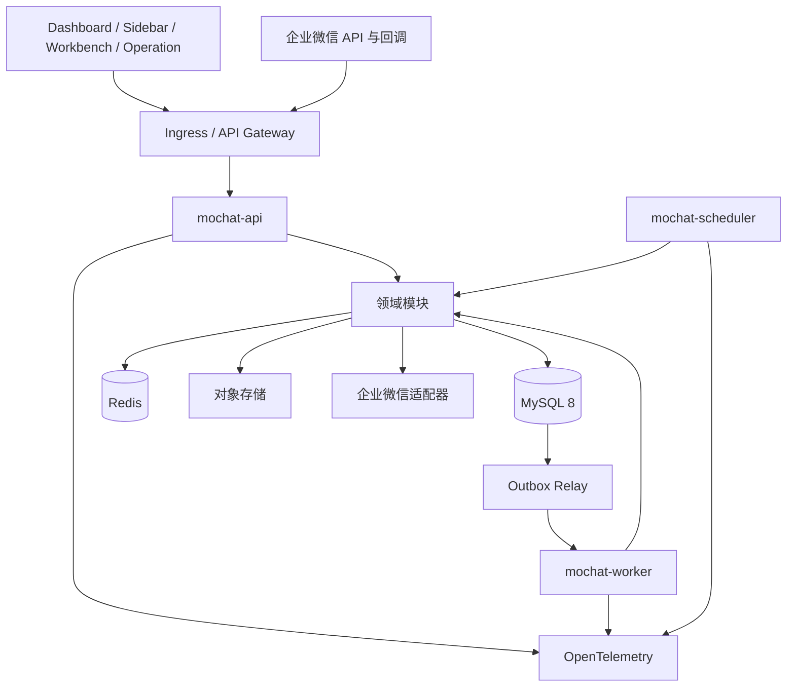
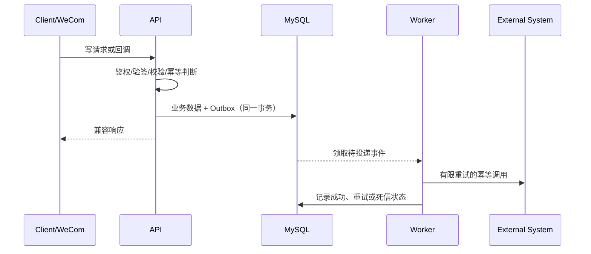

# MoChat Go 后端整体架构设计

**状态：** 已确认设计

**日期：** 2026-07-17

**范围：** 使用 Go 一次性重写 `api-server` 核心后端，并在验收后整体切换

**参考：** `doc/go-backend-migration-architecture.md`

## 1. 背景与目标

MoChat 当前后端基于 PHP 7.4、Hyperf 2.2 和 Swoole，包含多租户、RBAC、企业微信授权与回调、组织、客户、客户群、素材、会话工具、统计和官方插件等业务。目标是在不改变现有前端和外部调用方行为的前提下，用 Go 完整重写核心后端。

本项目采用“一次性重写、整体切换”，不采用长期 PHP/Go 双轨或按接口逐步替换。开发期可以使用 PHP 作为行为基准执行差异测试，但 PHP 与 Go 不得在生产环境中长期共同承担写入。

目标如下：

1. 完全兼容现有 HTTP API、鉴权、企业微信回调及可观察副作用。
2. 核心业务完整重写后整体切换；官方插件通过统一扩展机制按优先级交付。
3. 以模块化单体建立清晰领域边界，同时支持 API、Worker 和 Scheduler 独立扩容。
4. 基于 MySQL 8 改善租户隔离、数据约束、查询性能和迁移可验证性。
5. 满足 Kubernetes 中等规模集群的部署、弹性、可观测性和故障恢复要求。

## 2. 范围与非目标

### 2.1 范围内

- 现有核心模块的功能与行为等价实现。
- 全量 API 契约盘点、冻结、自动测试和差异验证。
- MySQL 5.7 到 MySQL 8 的数据迁移及必要的结构调整。
- 企业微信 API、回调、同步、重试、限流和幂等处理。
- API、异步任务、定时任务、缓存、文件和可观测性基础设施。
- 官方插件的统一注册、启停、权限、任务、事件和迁移扩展点。
- 整体切换、数据校验和时间受限的整体回退方案。

### 2.2 非目标

- 首期拆分领域微服务。
- 长期保留 PHP 与 Go 双写或双事实源。
- 为追求“Go 风格”而进行无业务收益的数据库重构。
- 使用运行时加载的 Go 原生 `plugin` 机制。
- 在本设计阶段创建 Go 工程或实现业务代码。

## 3. 架构决策

| 主题 | 决策 | 理由 |
| --- | --- | --- |
| 总体形态 | 模块化单体 | 降低一次性重写和整体切换风险，保留明确领域边界 |
| 运行入口 | API、Worker、Scheduler、Migrate | 共享业务模块，按负载和故障边界独立部署 |
| HTTP | `net/http` + `chi` | 贴近标准库、依赖轻、易于中间件组合 |
| API 契约 | OpenAPI 3.1，兼容契约优先 | 固化现有行为并支持破坏性变更检测 |
| 数据访问 | `database/sql` + `sqlc`，复杂查询使用封装后的手写 SQL | 编译期类型检查、SQL 可审计、查询行为明确 |
| 数据库 | MySQL 8 | 支持更完善的约束、索引和查询能力 |
| Schema 迁移 | `golang-migrate` | 版本化、可审计并适合 CI/CD |
| 缓存与队列 | Redis；队列语义封装在端口后 | 复用现有基础设施并避免业务绑定具体实现 |
| 一致性 | 本地事务 + Transactional Outbox + 幂等消费 | 避免数据库与外部副作用的双写不一致 |
| 配置与日志 | 显式配置结构体、启动校验、`log/slog` | 减少隐式全局状态，统一结构化日志 |
| 可观测性 | OpenTelemetry | 统一关联日志、指标和链路追踪 |
| 集成测试 | Go `testing` + Testcontainers | 验证真实 MySQL、Redis 和 migration 行为 |

Go 版本使用实施时仍受官方支持的稳定版本，在工具链文件和构建镜像中固定补丁版本。版本升级必须通过完整质量门禁，不在架构文档中绑定未来会过期的具体版本号。

## 4. 系统架构



### 4.1 运行单元

- `mochat-api`：承载 HTTP API 和 Webhook。进程无状态，可水平扩容。
- `mochat-worker`：承载 Outbox 投递、同步、媒体处理、消息发送等异步任务。按任务类别使用独立队列和 Deployment，依据积压与消费延迟扩容。
- `mochat-scheduler`：触发周期任务。多副本通过数据库或 Redis 租约避免重复调度；业务任务本身仍必须幂等。
- `mochat-migrate`：执行 Schema 迁移和受控数据迁移，不常驻运行。

### 4.2 依赖方向

每个领域模块采用以下逻辑分层：

```text
transport -> application -> domain
infrastructure -> application/domain 定义的 ports
cmd -> 组合根与依赖注入
```

- `transport`：解析协议、鉴权入口、参数校验、兼容响应映射，不包含业务规则和 SQL。
- `application`：用例编排、事务边界、授权决策、幂等控制和事件发布。
- `domain`：实体、值对象、聚合、领域服务和领域事件，不依赖 HTTP、数据库、Redis 或第三方 SDK。
- `infrastructure`：MySQL、Redis、消息、企业微信、对象存储和观测实现。

模块只能通过公开 Application API、领域事件或专用只读查询接口协作。禁止导入其他模块的内部实现，禁止绕过数据所有者直接写其业务表。

## 5. 领域模块

| 模块 | 现有业务归属 | 主要职责 |
| --- | --- | --- |
| `iam` | tenant、user、rbac | 登录、用户、租户上下文、角色、菜单和数据权限 |
| `corp` | corp、work-agent | 企业授权、应用配置、回调配置和企业状态 |
| `organization` | work-employee、work-department | 员工、部门、离职、分配和组织同步 |
| `contact` | work-contact | 外部联系人、标签、跟进、自定义字段和客户关系 |
| `room` | work-room | 客户群、群成员、群标签和群同步 |
| `content` | medium、official-account、common | 素材、文件、公众号和共享内容配置 |
| `campaign` | 渠道码、欢迎语、群发、裂变等插件 | 获客与运营活动及其插件扩展点 |
| `chatops` | chat-tool、会话存档 | 会话工具、存档、敏感词和风控 |
| `analytics` | statistic、index | 指标、看板、报表和专用读模型 |
| `platform` | install、系统配置、插件管理 | 安装、配置、审计、功能开关和插件注册 |

企业微信、对象存储和消息设施属于 `integrations`，不是业务模块。集成适配器不拥有业务规则。

## 6. 插件架构

插件采用编译期注册的业务扩展模块，不使用 Go 原生动态插件。每个插件声明：

- 标识、版本、依赖和配置 Schema；
- HTTP 路由和所需权限；
- 领域事件订阅和对外发布事件；
- 异步任务与定时任务处理器；
- 数据库 migration；
- 租户级功能开关和初始化逻辑。

插件只能调用稳定的宿主 Application API 和扩展端口，不得访问其他模块的内部包或绕过所有者写表。插件代码随主程序构建和发布，功能可按租户启停。未完成的官方插件在整体切换时必须明确延后启用或下线，不能隐式依赖 PHP 服务继续运行。

## 7. API 兼容策略

兼容范围包括：

- 路径、HTTP 方法、参数位置和内容类型；
- 字段名称、类型、空值、默认值、排序和分页语义；
- 响应包络、HTTP 状态、业务错误码和错误字段；
- 访问令牌、刷新、签名、权限和租户解析方式；
- Webhook 验签、加解密和响应协议；
- 调用方可观察到的数据库及外部副作用；
- 重复请求、超时和并发冲突下的行为。

执行步骤：

1. 自动和人工盘点 PHP 路由、请求验证、响应、异常映射、事件、任务和副作用。
2. 以现有真实行为冻结 OpenAPI 3.1 兼容契约，并对无法表达的副作用补充测试规范。
3. 建立脱敏请求样本库，同时调用 PHP 基准实现和 Go 实现。
4. 比对状态码、JSON、排序、错误码和副作用；所有差异必须消除或显式批准。
5. CI 对 OpenAPI 执行 breaking diff，阻止未批准的契约变化。

Go 内部可使用统一错误类型，但传输层必须映射回现有 API 的响应行为。

## 8. 数据架构

### 8.1 数据库改造原则

数据库结构不因语言偏好机械调整。只有当变更产生以下至少一种明确收益时才实施：

- 建立可靠的租户隔离；
- 修正字段类型、默认值、唯一性或引用完整性；
- 使聚合边界和数据所有权更清晰；
- 消除已证实的查询或写入性能瓶颈；
- 支持可审计迁移、归档或报表读模型。

优先调整项包括：

- 租户业务表补齐 `tenant_id`，建立匹配访问模式的组合索引；
- 为外部 ID、幂等键和业务唯一键建立数据库唯一约束；
- 规范时间、布尔、枚举、JSON 和金额字段类型；
- 统一 `created_at`、`updated_at`、`deleted_at` 等审计语义；
- 对会话、同步日志和审计等大表制定分区或归档策略；
- 报表使用专用读模型，避免复杂统计拖慢事务库。

外键是否落到 MySQL 由表规模、删除语义和迁移风险逐表决定；无论是否使用物理外键，所有引用关系都必须有索引、应用约束和一致性校验。

### 8.2 租户隔离

- 鉴权层生成不可变的 `RequestContext`，包含 `tenant_id`、`user_id`、`corp_id`、权限版本和请求标识。
- Repository 方法必须接收 `TenantScope`；系统级访问使用显式 `SystemScope`。
- SQLC 查询必须显式包含租户条件；通过静态检查、代码评审和集成测试防止遗漏。
- 缓存键、队列配额、外部 API 限流和并发控制均包含租户维度。

### 8.3 事务与一致性

单个用例的数据库写入在一个 MySQL 事务中完成。业务数据和 `outbox_events` 在同一事务写入，Worker 至少一次投递事件或执行外部调用。

消费者使用 `event_id`、来源事件 ID 或业务幂等键去重，并由数据库唯一约束作为最后防线。禁止把 Redis 锁作为唯一的正确性保障。



### 8.4 数据迁移与验证

迁移使用版本化 Schema migration 和可重复执行的一次性 ETL。至少进行两次类生产全流程演练。每次验证：

- 表和分区行数；
- 主键、唯一键和引用完整性；
- 关键金额、计数和状态聚合；
- 抽样记录的规范化哈希；
- 登录、授权、客户、群、同步和报表等关键业务查询；
- ETL 错误、跳过项和人工处置记录。

## 9. 缓存、队列与文件

- MySQL 是业务事实源；Redis 不保存不可恢复的唯一业务事实。
- 缓存键格式为 `{env}:{module}:{tenant}:{resource}:{id}:{version}`，必须定义 TTL、容量和失效策略。
- 缓存默认采用 cache-aside；数据提交后失效，允许短暂陈旧的场景必须明确记录。
- 队列按任务类型隔离，并设置并发、租户配额、最大重试、可见性超时和死信策略。
- 媒体元数据存 MySQL，文件存 S3 兼容对象存储；对象默认私有，通过受控签名 URL 访问。
- 上传校验 MIME、大小和扩展名，高风险文件执行异步安全扫描。

## 10. 错误处理与弹性

内部错误分为：参数校验、认证、授权、未找到、业务冲突、限流、依赖暂不可用、依赖永久失败和内部错误。错误包含稳定代码、可安全展示的信息、可重试标识和底层原因；底层原因只进入受控日志。

外部调用必须设置连接、请求和整体超时。仅对明确可重试的网络错误、限流和临时服务错误执行带抖动的指数退避。业务拒绝、签名失败和无效参数不得重试。

重试超过上限后进入死信状态，保存任务类型、租户、业务标识、错误代码、尝试次数和 trace 标识。人工重放需要权限校验、审计记录，并继续遵守幂等规则。

## 11. 安全

- 密钥由 Secret Manager 或 Kubernetes Secret 注入，不进入 Git、镜像、日志或错误响应。
- 企业微信回调强制验签、解密、时间窗校验和来源事件去重。
- 保持现有鉴权协议兼容；内部令牌校验、撤销和权限缓存必须可追踪。
- SQL 仅使用参数绑定；动态排序和字段名使用白名单。
- 后台管理操作执行细粒度授权，重要变更写不可抵赖审计记录。
- 日志和 trace 对令牌、密钥、手机号等敏感信息脱敏。
- CI 执行依赖漏洞、许可证和容器镜像扫描。

## 12. Kubernetes 运行模型

- API、各类 Worker 和 Scheduler 使用独立 Deployment。
- API 根据 CPU、并发或延迟指标扩容；Worker 根据 backlog 和消费延迟扩容。
- 所有服务提供 startup、readiness 和 liveness 探针。依赖短暂异常不应导致无意义重启风暴。
- Pod 终止时停止接收新流量和任务，等待在途请求，在租约约束下完成或释放任务，并刷新 telemetry。
- Scheduler 多副本通过租约选主或按任务加锁，但任务处理仍需幂等。
- 配置通过 ConfigMap 和 Secret 注入，启动时执行完整校验；非法配置导致快速失败。
- 定义 PodDisruptionBudget、资源 request/limit、拓扑分布和滚动发布策略。

## 13. 可观测性与 SLO

日志使用 JSON，至少包含 `timestamp`、`level`、`service`、`module`、`request_id`、`trace_id`、`tenant_id`、`user_id`、`event_id` 和 `error_code`。高基数字段不得直接作为 Prometheus 标签。

核心指标包括：

- API 请求量、错误率和延迟；
- MySQL 连接池、慢查询、锁等待和事务失败；
- Redis 命中率、错误和连接状态；
- 队列积压、最老任务年龄、消费延迟、重试和死信；
- 企业微信 API 成功率、延迟、限流和错误码；
- 同步游标、同步滞后和数据校验差异；
- 每租户的限流、并发和配额消耗。

核心 API 初始可用性目标为月度 99.9%。延迟、吞吐和队列恢复目标由迁移前生产基线与容量测试确定，并在上线审批前固化为可执行 SLO。告警基于用户影响、错误预算、队列滞后和依赖耗尽，不仅监控 Pod 是否存活。

## 14. 工程结构

```text
api-server-go/
  cmd/
    api/
    worker/
    scheduler/
    migrate/
  internal/
    platform/
    modules/
      iam/
        domain/
        application/
        transport/http/
        infrastructure/
      corp/
      organization/
      contact/
      room/
      content/
      campaign/
      chatops/
      analytics/
    integrations/
      wecom/
      storage/
      messaging/
    plugins/
  api/openapi/
  db/
    migrations/
    queries/
  tests/
    contract/
    integration/
    e2e/
  deployments/
```

`internal/platform` 只容纳跨模块且无业务归属的基础能力，例如配置、日志、追踪、事务执行器、时钟和通用错误设施。默认不建立宽泛的 `common` 或 `utils` 包；可复用代码只有在出现稳定的真实复用场景后才抽取。

## 15. 测试与质量门禁

### 15.1 测试层次

- 单元测试：领域规则、用例分支、权限、幂等、重试和错误映射。
- 集成测试：真实 MySQL 8、Redis、SQLC 查询、事务、migration 和 Outbox。
- 契约测试：PHP 与 Go 对相同请求的状态、响应、错误和副作用差异。
- E2E：登录、企业授权、组织同步、客户管理、群管理、活动任务和回调重放。
- 性能与恢复测试：核心查询、回调突发、队列堆积恢复、限流和优雅停机。

### 15.2 CI 门禁

- `gofmt`、`go vet`、`staticcheck`；
- 单元和集成测试；核心并发包执行 race detector；
- 核心领域与用例覆盖率不低于 80%，整体覆盖率作为趋势指标；
- migration lint 和从空库、基线库升级测试；
- OpenAPI breaking diff 和 PHP/Go 契约测试；
- 依赖、许可证、Secret 和容器镜像扫描。

## 16. 整体切换与回退

### 16.1 切换阶段

1. **资产盘点与契约冻结：** 完成路由、数据、任务、事件、插件、外部集成和关键验收样例清单。
2. **完整重写：** 核心模块全部完成；官方插件按优先级接入统一扩展点。
3. **验证与演练：** 执行契约差异、E2E、容量、故障恢复和至少两次类生产数据迁移演练。
4. **停写与迁移：** 停止 PHP 写入和异步消费者，记录水位，执行最终增量迁移和校验。
5. **整体切换：** 网关一次性切到 Go，按内部用户、试点租户和全量请求逐级开放，但不把写请求分流给两个实现。
6. **稳定观察：** 在明确窗口内强化监控与业务核对，窗口结束后归档 PHP。

### 16.2 回退规则

回退是整体基础设施回退，不是长期双轨方案。默认回退窗口为切换后 24 小时；上线审批可以缩短但不得延长。触发阈值必须在演练前固化并自动告警。

若窗口内触发回退：停止 Go 写入和 Worker，导出并校验 Go 上线后的增量变更，将增量以经过演练的脚本回放至 PHP 可用数据库，然后整体恢复 PHP。若增量已无法可靠逆向迁移，则不得盲目回退，应进入前向修复和受控降级流程。

## 17. 上线硬门槛

只有同时满足以下条件才允许整体切换：

1. 核心 API 契约不存在未批准差异。
2. 核心模块完整，关键 E2E 全部通过。
3. 数据迁移校验不存在原因不明的差异。
4. 至少两次类生产全流程迁移与切换演练成功。
5. 容量测试达到生产峰值目标并保留约定余量。
6. 监控、告警、备份恢复、死信重放和回退演练通过。
7. 未完成插件已得到明确的下线或延期批准，不存在隐式 PHP 运行依赖。

## 18. 主要风险与控制

| 风险 | 控制措施 |
| --- | --- |
| 隐含 API 行为未被发现 | 自动路由盘点、生产样本脱敏回放、PHP/Go 差异测试 |
| 一次性重写周期长、反馈晚 | 按领域内部增量完成，持续运行契约与 E2E，不提前生产分流 |
| 数据结构调整导致迁移错误 | 仅做收益明确的调整，多次全量演练和多维校验 |
| 外部副作用重复或丢失 | Outbox、业务幂等键、唯一约束、有限重试和死信重放 |
| 模块化单体退化为大泥球 | Go `internal` 边界、依赖检查、公开 Application API 和表所有权评审 |
| 插件破坏核心边界 | 编译期注册、稳定扩展端口、权限与 migration 声明、禁止跨模块写表 |
| 整体回退造成数据分叉 | 单写者原则、限时窗口、增量回放演练、无法逆迁移时前向修复 |

## 19. 验收结果

本设计完成时应形成一致的架构基线：模块边界、运行拓扑、API 兼容规则、数据库改造原则、一致性策略、插件扩展机制、Kubernetes 运行模型、测试门禁以及整体切换与回退规则均有明确决策，不包含待定技术选型或依赖长期 PHP/Go 双轨的路径。
