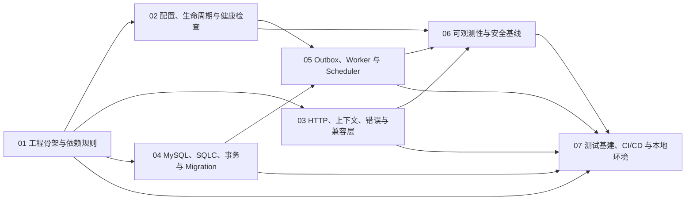

# Go 工程底座详细设计文档规划

**状态：** 已批准（7 份详细设计于 2026-07-19 完成联合评审）

**日期：** 2026-07-18

**上位设计：** `docs/superpowers/specs/2026-07-17-go-backend-architecture-design.md`

## 1. 目标

将 MoChat Go 后端总体架构中的工程底座拆分为 7 份可独立评审、实施和验收的详细设计文档。首批文档不展开 IAM、客户、群、活动等业务域，只建立所有业务模块共同依赖的工程能力。

本规划的交付物是详细设计文档体系及其编写顺序，不创建 Go 工程，不实现业务代码。

## 2. 拆分原则

采用“基础能力分层拆分”，而不是按运行进程或交付里程碑拆分。

- 每份文档只设计一个稳定能力边界。
- 每份文档必须能独立评审，并对应可独立验收的实施结果。
- 共享术语和总体架构决策引用上位设计，不重复定义。
- API、Worker、Scheduler 共享的能力只定义一次，避免按进程重复描述。
- 文档使用真实包路径、接口签名、配置名、表结构和事件结构，不停留在原则层面。
- 正式确认的文档不得保留待定项或互相矛盾的类型与规则。

## 3. 被否决的组织方式

### 3.1 按运行进程拆分

分别为 API、Worker 和 Scheduler 编写文档。该方式运行视角直观，但配置、数据库、生命周期和可观测性规则会在多份文档中重复，容易产生不一致，因此不采用。

### 3.2 按交付里程碑拆分

按照“可启动、可访问数据库、可处理任务、可部署”等阶段编写文档。该方式适合实施计划，但长期查阅时技术边界不清晰，同一能力会散落在多个里程碑中，因此不作为详细设计文档结构。

## 4. 文档清单

详细设计统一放置在：

```text
docs/superpowers/specs/go-foundation/
```

| 编号 | 文件 | 主题 | 独立验收结果 |
| --- | --- | --- | --- |
| 01 | `01-project-foundation-design.md` | 工程骨架与依赖规则 | 能创建空业务模块，静态检查可阻止违规依赖 |
| 02 | `02-runtime-lifecycle-design.md` | 配置、生命周期与健康检查 | API、Worker、Scheduler 可用统一生命周期可靠启停 |
| 03 | `03-http-api-compatibility-design.md` | HTTP、上下文、错误与兼容层 | 兼容接口可稳定复现现有 PHP 契约 |
| 04 | `04-data-persistence-design.md` | MySQL、SQLC、事务与 Migration | 用例可在明确事务中安全访问租户数据并原子写 Outbox |
| 05 | `05-async-processing-design.md` | Outbox、Worker 与 Scheduler | 任务在至少一次投递下保持业务幂等，失败可审计和重放 |
| 06 | `06-observability-security-design.md` | 可观测性与安全基线 | API 与异步任务可端到端关联且不泄露敏感信息 |
| 07 | `07-engineering-quality-design.md` | 测试基建、CI/CD 与本地环境 | 全新环境可用固定命令完成生成、测试、构建和质量检查 |

## 5. 依赖关系与编写顺序



编写顺序如下：

1. 先完成并确认 01，它锁定包结构、依赖方向、组合根和扩展接口。
2. 01 确认后，02、03、04 可分别设计；正式合并前需交叉检查共享类型。
3. 05 依赖 02 的生命周期与 04 的事务、Outbox 定义。
4. 06 汇总 API、Worker 和 Scheduler 的观测与安全要求，依赖 02、03、05。
5. 07 最后完成，覆盖前六份文档规定的生成、测试和质量门禁。

详细设计文档可以并行起草，但必须按上述依赖顺序确认，避免下游文档自行发明上游接口。

## 6. 统一文档模板

每份详细设计固定包含以下章节；确实不适用的章节必须说明“不适用”及原因，不得直接省略：

1. 目标、范围与非目标；
2. 上游依赖与下游使用者；
3. 关键决策及被否决方案；
4. 包、文件和组件职责；
5. 对外接口与完整 Go 类型签名；
6. 配置项、默认值和启动校验；
7. 正常数据流与关键时序；
8. 事务、并发、幂等和一致性规则；
9. 错误分类、超时、重试与降级；
10. 安全、租户隔离和敏感数据处理；
11. 日志、指标与 Trace 要求；
12. 测试矩阵及具体验收场景；
13. 性能边界与容量假设；
14. 发布、迁移、回退和兼容要求；
15. 未解决问题。

第 15 节用于起草期间记录问题。文档状态变为“已确认”前，该节必须为空，并明确写为“无未解决问题”。

## 7. 单篇文档内容边界

### 7.1 01 工程骨架与依赖规则

必须定义：

- Go Module 名称和 Go 版本管理方式；
- `cmd`、`internal/platform`、`internal/modules`、`internal/integrations`、`internal/plugins` 的具体目录；
- API、Worker、Scheduler、Migrate 的组合根；
- 依赖注入方式和启动装配顺序；
- 模块公开 Application API、领域事件和专用查询接口；
- `internal` 可见性、包命名和禁止依赖规则；
- 编译期插件注册及租户级启停接口；
- 架构依赖静态检查方案。

不得设计 HTTP 细节、数据库连接池参数或队列重试算法，这些属于后续文档。

### 7.2 02 配置、生命周期与健康检查

必须定义：

- 配置来源、优先级、环境变量命名和类型；
- 默认值、必填项、Secret 标记和启动校验；
- API、Worker、Scheduler 的公共生命周期接口；
- 启动阶段、依赖就绪、停止接流、任务排空和退出顺序；
- startup、readiness、liveness 探针语义；
- Kubernetes `terminationGracePeriodSeconds` 与应用超时的关系；
- 非法配置、依赖暂时不可用和停机超时的错误行为。

### 7.3 03 HTTP、上下文、错误与兼容层

必须定义：

- `chi` 路由组织和中间件执行顺序；
- request、trace、tenant、user、corp 和权限上下文类型；
- 认证与权限检查接口，但不重写 IAM 领域规则；
- JSON 解码、参数校验、分页、排序白名单和 body 限制；
- 内部错误类型、稳定错误码和现有 PHP 响应映射；
- OpenAPI 3.1 目录、生成、breaking diff 和兼容测试流程；
- Webhook 接入所需的通用验签与原始报文保留接口。

### 7.4 04 MySQL、SQLC、事务与 Migration

必须定义：

- MySQL 8 连接、连接池、超时和健康检查；
- SQLC 配置、查询目录、生成代码边界和命名规则；
- `TenantScope`、`SystemScope` 和租户 SQL 审查机制；
- Transaction Manager、Repository 与用例事务边界；
- `outbox_events` 的完整表结构、索引和状态转换；
- `golang-migrate` 文件命名、执行、回退和 CI 校验；
- Testcontainers 数据库测试和迁移测试方式。

### 7.5 05 Outbox、Worker 与 Scheduler

必须定义：

- 领域事件和任务消息的包络、版本及兼容规则；
- Outbox Relay 的领取、锁定、续租、发布和清理算法；
- 队列端口以及 Redis 实现的消息确认语义；
- Handler 注册、Worker 并发、租户公平性和背压；
- 重试分类、指数退避、最大次数和死信结构；
- 幂等记录、业务唯一约束和人工重放；
- Scheduler 租约、错过执行、补偿和任务幂等规则；
- Pod 终止时的任务停止领取与租约处理。

### 7.6 06 可观测性与安全基线

必须定义：

- `slog` 字段、日志等级、采样和敏感字段脱敏；
- OpenTelemetry Resource、Tracer、Meter 和上下文传播；
- API、数据库、Redis、队列、Worker、Scheduler 和企业微信指标；
- 指标名称、单位、标签白名单及高基数限制；
- 审计事件结构、保存范围和查询权限；
- Secret 注入、轮换和禁止输出规则；
- HTTP 安全头、CORS、限流和上传安全基线；
- SLO、告警和排障关联字段。

### 7.7 07 测试基建、CI/CD 与本地环境

必须定义：

- 单元、集成、契约、E2E 和性能测试目录；
- Testcontainers 的 MySQL、Redis 和对象存储测试基座；
- PHP/Go 契约样本、脱敏、规范化和差异报告；
- `go generate`、SQLC、OpenAPI 和 mock 生成命令；
- `gofmt`、`go vet`、`staticcheck`、race、覆盖率和安全扫描；
- Migration 从空库和基线库升级测试；
- 本地依赖环境、固定入口命令和最小开发工作流；
- 容器构建、SBOM、镜像扫描和部署前门禁。

## 8. 跨文档一致性规则

- 上游文档定义的包路径、类型名和函数签名是下游文档的唯一依据。
- 共享类型只能由一个文档拥有，其他文档引用而不重复定义。
- 配置名称采用统一前缀与层级；同一配置不得在不同文档中出现不同默认值。
- 错误码、事件名、指标名和数据库对象采用各自唯一命名规范。
- 所有时间均明确单位，所有超时均明确默认值和允许范围。
- 所有重试规则均明确可重试错误、最大次数、退避、抖动和最终状态。
- 所有多租户数据流均明确 tenant 来源、传播、查询约束和审计字段。
- 文档间发生冲突时，先修订拥有该定义的上游文档，再更新下游引用。

## 9. 单篇评审门禁

每份详细设计只有满足以下条件才能标记为“已确认”：

1. 范围与非目标清晰，没有侵入其他文档的责任边界。
2. 所有公开接口包含完整 Go 类型签名和所属包路径。
3. 所有配置包含名称、类型、默认值、校验和 Secret 属性。
4. 数据结构、事件、错误和状态转换无歧义。
5. 正常流程、失败流程、并发和停机行为均已覆盖。
6. 安全、租户隔离、观测和测试要求明确。
7. 至少包含一个端到端验收场景及可判定结果。
8. 与所有已确认上游文档不存在冲突。
9. 不含 `TBD`、`TODO`、占位符或未解决问题。

## 10. 整批完成标准

7 份文档全部确认后，工程底座详细设计阶段才算完成。完成时必须满足：

- 从进程入口到模块、持久化、异步任务和可观测性的依赖链完整；
- Go 包、接口、配置、表、事件、错误和指标命名相互一致；
- API、Worker、Scheduler 的启动、运行和停止行为闭环；
- 事务、Outbox、队列、重试、死信和幂等形成可验证的数据流；
- 本地环境和 CI 能验证前六份文档的全部工程约束；
- 每份文档都能转化为独立实施计划和测试验收任务。

## 11. 后续顺序

本规划书面复核通过后：

1. 创建 7 份文档的逐篇编写实施计划；
2. 先起草并评审 `01-project-foundation-design.md`；
3. 01 确认后再安排 02、03、04；
4. 按依赖完成 05、06、07；
5. 工程底座详细设计全部确认后，才进入 Go 工程实施规划。

## 12. 未解决问题

无未解决问题。
