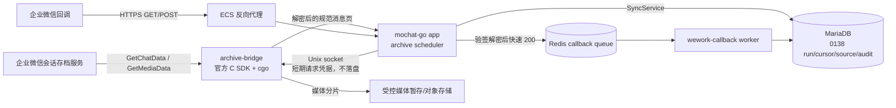

# Phase 7 真实企业微信会话存档设计

> 日期：2026-08-17（Asia/Shanghai）
> 状态：设计基线已确定，尚未开始代码实现或生产部署
> 目标环境：阿里云 ECS，应用与 SDK 镜像必须在本地构建后传输，服务器禁止源码编译

## 1. 目标

Phase 7 把当前 `wecom_archive=limited` 的占位能力升级为可验证的真实企业微信会话存档能力，并同时闭合两条互补数据链路：

1. **主动拉取**：使用企业微信官方会话内容存档 C SDK 调用 `GetChatData`、`DecryptData` 和 `GetMediaData`，按企业微信 `seq` 增量同步会话正文和媒体文件。
2. **被动接收**：复用现有 `GET/POST /weWork/callback`，验证 URL、验签、解密、快速应答并异步处理通讯录、客户、客户群等企业微信事件。

企业微信会话存档本身是 SDK 主动拉取模型，不把普通应用回调描述成“会话正文推送”。回调链路用于接收企业微信事件和验证外网入站能力；会话正文完整性仍由持续轮询、游标追赶和补拉保证。

## 2. 已有基础与必须修正的问题

项目已经具备以下基础：

- `internal/modules/providers/archive.ArchiveSource`、`SyncService` 和迁移 `0138_archive_source_sync`，已实现 tenant/corp/source/namespace 隔离、幂等、游标、lease fencing 和审计。
- `internal/modules/providers/archive/wecom.Archive` 已持有真实 Provider 的配置与状态边界，但 `Fetch` 仍固定返回 `archive.getchatdata_unimplemented`。
- `internal/dashboard.WorkMessageArchiveBridgeClient` 与旧 `WorkMessageArchiveSyncCron` 已定义 bridge 合同和 `seq` 拉取流程。
- `GET/POST /weWork/callback`、Redis `wework-callback` 队列及 worker 已支持 URL 验证、POST 解密和多类事件异步处理。
- 企业微信凭据已由 `internal/wecomcredentials.Manager` 使用 AES-256-GCM 加密保存。

Phase 7 不沿用以下风险做法：

- bridge 不再监听 TCP 端口，也不允许从 ECS 公网或 Docker bridge 网络访问。
- 主应用不再把 `chat_secret`、RSA 公钥和 RSA 私钥通过普通 HTTP JSON 请求发送给 bridge。
- 不再以旧 `mc_work_message_id.type=40` 单游标作为唯一权威进度；新的真实同步必须使用 `0138` durable run/cursor/source/audit 账本。
- 不把“凭据存在”“SDK 初始化成功”“worker running”或 fake 测试通过标记为真实 `ready`。

## 3. SDK 选择

### 3.1 选择：官方 C SDK + 项目内薄 `cgo` 适配层

Phase 7 使用企业微信管理后台/官方文档提供的 Linux x86_64 会话内容存档 C SDK。SDK 二进制作为受控构建输入，不提交到 Git；仓库只保存获取说明、所需文件名、批准的 SHA-256、许可证/再分发核对结果和适配代码。

不直接依赖第三方 Go wrapper。调研到的 Go wrapper 最终仍通过 `cgo` 调用同一 C SDK，且 `github.com/qycorp/WeWorkFinanceSDK` 会重定向到个人维护仓库；它可以作为消息类型映射参考，但不能成为生产信任根。项目内适配层只暴露本阶段需要的三个接口，降低上游变更和供应链风险。

### 3.2 SDK 供应链门禁

本地受控目录固定为 `.local-sdk/wecom-finance/linux-amd64/`，由 `.gitignore` 排除。构建前执行 `scripts/verify_wecom_finance_sdk.ps1`，验证：

- `libWeWorkFinanceSdk_C.so` 与官方头文件齐全；
- 架构为 Linux x86_64；
- SHA-256 与 `third_party/wecom-finance-sdk/checksums.txt` 中批准值一致；
- SDK 不被复制进源码压缩包、Git diff 或浏览器证据；
- 未完成许可证/再分发核对时，发布流程失败关闭。

## 4. 总体架构



### 4.1 SDK sidecar

新增 `mochat-wecom-archive-bridge` 独立进程，使用 Debian/glibc Linux amd64 运行镜像承载官方 `.so`，避免把现有 Alpine、`CGO_ENABLED=0` 的主应用整体改成动态链接程序。

bridge 只监听共享卷中的 Unix socket `/run/mochat-wecom-archive/archive.sock`：

- socket 目录不映射到宿主机公网；
- app 与 bridge 使用同一非 root GID，socket 权限为 `0660`；
- bridge 不暴露 Compose `ports`；
- 请求体上限固定，禁止日志记录请求体、Secret、RSA 私钥、解密明文和原始 SDK 错误内容；
- 每次请求创建/复用受控 SDK client，请求结束释放 C 资源，进程退出前清理全部句柄。

### 4.2 bridge 合同

主应用通过自定义 `http.Transport.DialContext` 连接 Unix socket，继续复用 HTTP 编解码和超时语义。内部接口固定为：

- `GET /healthz`：只证明进程、动态库和 socket 可用，不调用企业微信。
- `POST /v1/archive/pages`：输入 `wxCorpId`、`chatSecret`、版本化私钥环、`seq`、`limit`、timeout；输出已解密消息、`nextSeq`、`hasMore` 和稳定错误码。
- `POST /v1/archive/media/chunks`：输入 `sdkFileId`、`indexBuf` 和同一企业凭据；输出 base64/二进制分片、`outIndexBuf`、`isFinish`、长度与校验信息。

上述敏感字段只在同机 Unix socket 内短暂传输，不写日志、不写 bridge 数据库、不进入审计 JSON。主应用仍是凭据解密和租户授权的唯一权威。

### 4.3 真实 ArchiveSource

在 `internal/modules/providers/archive/wecom` 中把 bridge client 注入 `Archive`：

- `Kind=external`、`SourceID=wecom:<wx_corpid>`、`Namespace=wecom`；
- `Fetch` 调 bridge，按 `publickey_ver` 选择对应 RSA 私钥，由 SDK 完成 `DecryptData`；
- 输出既有 `archive.Message`，保留 `msgid/seq/action/from/tolist/roomid/msgtype/msgtime`、规范文本和原始结构；
- 只有 SDK health、真实 `GetChatData` 成功、消息解密成功、`0138` run 成功落库且能从 Dashboard 回读时才返回 `ready`；
- SDK 错误映射到 `archive.sdk_params`、`archive.sdk_network`、`archive.decrypt_failed`、`archive.private_key_version_missing`、`archive.ip_not_allowed`、`archive.data_expired` 等稳定代码。

### 4.4 版本化 RSA 私钥

`GetChatData` 返回 `publickey_ver`。单个 `ArchiveRSAPrivateKey` 无法安全覆盖密钥轮换，因此 Phase 7 将企业凭据扩展为版本化 keyring：

```json
{
  "activeVersion": 3,
  "keys": {
    "2": "encrypted-key-material-v2",
    "3": "encrypted-key-material-v3"
  }
}
```

keyring 整体继续由 `wecomcredentials.Manager` 加密。旧单 key 数据在读取时映射到显式版本，确认新版本已完成真实解密后才允许移除旧版本；缺少消息对应版本时失败关闭且不推进 cursor。

## 5. 主动拉取数据流

1. scheduler 查询当前认证租户下已启用、已验证且会话存档配置完整的企业。
2. 为每个 tenant/corp/source 创建稳定 idempotency key，由 `SyncService` 获取 DB lease。
3. 从 `0138` cursor 的最大成功 `seq` 调用 bridge；首次从 `0` 开始。
4. bridge 调 `GetChatData(seq, limit)`，逐条按 `publickey_ver` 选择私钥并调用 `DecryptData`。
5. 主应用校验消息来源、`msgid`、`seq`、时间和类型，写入现有 `mc_work_message_1..10` 及 `mochat_go_archive_message_sources`。
6. 同一页全部业务消息和 source identity 成功提交后才推进 durable cursor；任一解密、映射或存储失败均停止本轮，不跳过未知消息。
7. `hasMore=true` 时在同一 lease 下继续拉取；空页结束本轮。下一周期从已提交 cursor 继续。
8. 媒体消息写入 outbox；独立媒体 worker 用 `GetMediaData` 分片拉取，写 `.part` 文件，完成后校验大小/MD5并原子 rename。媒体失败不回滚已落库正文，但页面显示媒体 `pending/failed`，允许幂等重试。

默认每 60 秒启动一轮，每页 100 条；这两个值保持可配置。正式验收前根据企业微信后台的实际配额和消息量调整，但 `limit` 永不超过 SDK 允许上限。

## 6. 被动回调数据流

现有回调入口保留：

- 企业微信管理后台配置 HTTPS URL、Token、EncodingAESKey；
- `GET` 完成 URL 有效性验证并在 1 秒内返回解密后的 `echostr`；
- `POST` 校验 `msg_signature/timestamp/nonce`，解密 XML 后把最小规范事件写入 Redis，并立即返回空 `200`；
- worker 按 `MsgId` 或事件稳定键去重，处理通讯录、客户、客户群、标签等事件；处理失败进入 retry/dead-letter，不要求企业微信同步等待业务处理；
- 反向代理只公开 callback 与产品必需路由，bridge socket 永不暴露。

回调 live 验收至少覆盖 URL 验证和一个真实可控事件；如果企业微信后台无法人工触发某类事件，则记录为 `SKIP`，不能用本地构造 XML 冒充 live PASS。

## 7. ECS 构建与部署

### 7.1 本地构建

本地通过 Docker Desktop/BuildKit 构建 `linux/amd64`：

- 主应用镜像保持现有静态 Go 构建；
- bridge 镜像在 Debian builder 中启用 `CGO_ENABLED=1`，链接本地批准的官方 SDK；
- 生产镜像包含运行所需 `.so`，但不包含 SDK 压缩包、头文件、测试私钥或构建缓存；
- 执行容器级 smoke，证明主应用可经 Unix socket 调 bridge fake backend；真实 SDK live 调用只在授权的 ECS 出口 IP 白名单生效后进行；
- 两个镜像均以不可变 SHA 标签输出，并用 `docker save -o` 生成单一 tar 工件及 SHA-256 清单。

### 7.2 传输与服务器部署

服务器地址、账号、口令和密钥不得进入 Git。操作机通过环境变量 `MOCHAT_PHASE7_ECS_HOST` 和 SSH key 定位目标；禁止在命令行参数中传递密码。

部署顺序：

1. 本地生成 release manifest、镜像 tar、compose override、迁移和校验和。
2. 上传到 ECS 的具名 release 目录，不覆盖当前 release。
3. 只读记录当前 app/mysql/redis 容器 ID、镜像 digest、迁移 ledger、四个数据卷和磁盘空间。
4. 做加密数据库备份与恢复可读性检查。
5. `docker load` 本地构建镜像；服务器不执行 `docker build`、`go build`、`pnpm build`。
6. 运行一次性迁移容器，确认 `0140` ledger/checksum。
7. 启动 bridge，验证 socket `/healthz`；再替换 app，MySQL/Redis 和 named volumes保持不变。
8. 验证 `/readyz`、Provider 状态、callback URL、一次真实 pull、一次媒体下载和 Dashboard 回读。
9. 失败时回滚 app/bridge 旧镜像；数据库若已执行 forward-only 迁移，则按兼容代码回滚，不自动 down migration。

## 8. 安全与合规

- 用户在对话中提供的服务器口令视为已暴露：不得写入文档、脚本、shell history 或日志，Phase 7 开始部署前必须轮换并改用 SSH key。
- ECS 安全组仅开放产品 HTTPS；SSH 限制管理来源；MySQL、Redis、bridge socket不对公网开放。
- 会话内容可能包含个人信息、敏感个人信息和商业秘密。上线前需完成明确的处理目的、告知/同意或其他合法性基础、最小开启范围、保存期限、访问审计、查阅/删除流程和事件响应方案。
- 原始密文、RSA 私钥、Chat Secret、回调 AES Key 不进入普通日志、错误响应、截图、浏览器缓存或验收包。
- Dashboard 沿用 Phase 4 RBAC 和员工数据范围；普通用户不能通过深链、导出或搜索绕过 `tenant/corp/employee` 过滤。
- AI 分析不得自动消费真实会话，除非另行完成目的、范围和合规确认；Phase 7 live 验收期间保持 AI 自动分析关闭。

## 9. 验收口径

只有同时满足以下条件才可把 `wecom_archive` 标为 `ready`：

1. SDK 文件 checksum 与构建来源可追溯，Linux amd64 bridge 在本地构建成功。
2. fake SDK、fake bridge、消息类型、密钥版本、错误码、内存释放和并发测试通过。
3. 真实临时 MariaDB 验证 cursor、lease、幂等、失败不推进、重试和 source identity。
4. ECS 上真实 `GetChatData` 至少拉取双向单聊、群聊、撤回和一种媒体消息。
5. 媒体分片完整、校验通过、鉴权下载可用。
6. 企业微信真实 callback URL 验证通过，并收到至少一个真实事件进入 worker/审计。
7. Dashboard 会话五页及相关风险/报表能回读真实 external 数据；普通用户范围与超管范围均验证。
8. 重启 app/bridge 后不重复写消息、不回退 cursor、不泄漏 secret。
9. 备份、回滚、监控和告警证据齐全，服务器未发生源码编译或卷破坏。

无法取得真实会话存档授权、出口 IP 白名单或真实消息证据时，状态必须保持 `limited`，其余代码门禁可以标为通过，但不得宣告 Phase 7 完成。

## 10. 外部资料

- 企业微信官方《获取会话内容》：<https://developer.work.weixin.qq.com/document/path/91774>
- 企业微信官方《接收消息与事件》：<https://developer.work.weixin.qq.com/document/path/90238>
- 企业微信官方《回调配置》：<https://developer.work.weixin.qq.com/document/path/90930>
- 《中华人民共和国个人信息保护法》国家法律法规数据库：<https://flk.npc.gov.cn/detail?fileId=&id=ff8081817b6472a3017b656cc2040044&type=>

外部文档可能调整。实现时以企业微信管理后台当日提供的 SDK、头文件和官方文档为准，并把版本、文件名和 SHA-256 固化为 Phase 7 release evidence。
